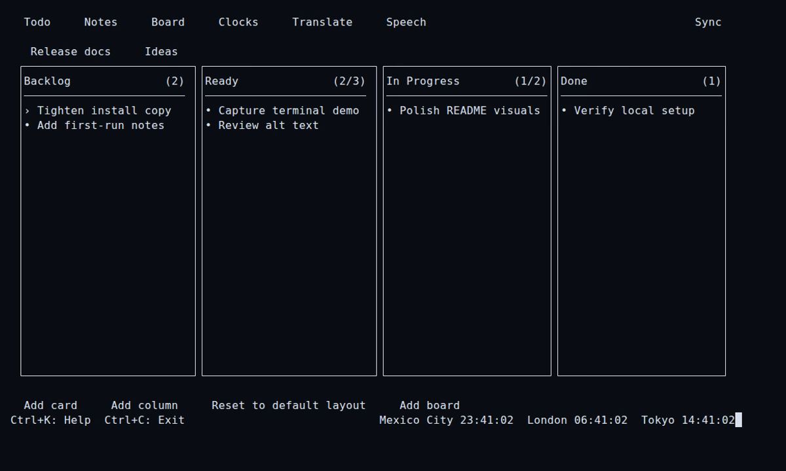

# ilu

**Run your personal workflow from one terminal workspace.**

`ilu` brings tasks, notes, boards, world clocks, translation, text-to-speech, and optional Git sync into a single CLI and integrated TUI. Your productivity data stays in readable files under `~/.ilu/`, so you can work locally, inspect what you own, and add remote sync when you want it.

```bash
ilu ui
```



_Plan work across four Board columns, then move between tools without leaving the terminal. [Watch the Todo → Board → Todo workflow](docs/assets/ilu-workflow.gif) or [open the WebM version](docs/assets/ilu-workflow.webm)._

## Why ilu

- **One terminal workspace:** move between Todo, Notes, Board, Clocks, Sync, Translate, and Speech without assembling separate tools.
- **Local-first data:** Todos, Notes, Boards, and Clocks are written to files under your home directory before optional remote sync runs.
- **Two ways to work:** use focused CLI commands for quick actions or open the TUI for a persistent interactive workspace.
- **Optional Git sync:** connect your data directory to a Git remote, with automatic retry and durable recovery for pending work.
- **Safe external-change handling:** revision conflicts preserve the current file, reload or reconcile it, and ask you to repeat the interrupted action.
- **Compatible upgrades:** existing Todo, Notes, and Board data remains readable, and legacy sync state is migrated into the current private runtime state.

## What you can manage

| Area           | What it gives you                                                                                      |
| -------------- | ------------------------------------------------------------------------------------------------------ |
| Todo           | Multiple task lists, completion state, details, editing, removal, and priority ordering                |
| Notes          | Multiple note lists with inline multiline editing, details, and ordering                               |
| Board          | Multiple boards built from columns and cards, with movement, priority, default columns, and WIP limits |
| Clocks         | A prioritized list of named clocks backed by IANA time zones                                           |
| Sync           | Optional Git-backed sync with status, retry, enable, and disable controls                              |
| Translate      | Source detection, target-language selection, terminal output, and clipboard copy                       |
| Text-to-Speech | Audio generation from `.txt` and `.md` files, voice selection, chunking, and resumable generation      |

## Install from this repository

### Requirements

- Node.js `>=20.11.0`
- npm
- An interactive terminal for commands that prompt for input or selection
- Git and access to a Git remote if you enable sync
- An OpenAI API key and network access if you use text-to-speech

Install the dependencies from an existing checkout:

```bash
npm install
```

Run `ilu` directly from the repository:

```bash
node bin/cli.js --help
```

Expose the `ilu` command globally from this checkout with either option:

```bash
npm link
```

```bash
npm install -g .
```

Confirm the installed command:

```bash
ilu --version
ilu --help
```

This README documents installation from the repository. It does not assume that the `ilu` package is published to npm.

## Quick start

Open the full workspace:

```bash
ilu ui
```

Or create your first task from the CLI and display the active list:

```bash
ilu todo --add
ilu todo
```

Most create, edit, remove, and selection flows are interactive. Run them in a TTY and follow the prompts. Commands that only display current data can be used directly.

## The TUI workspace

`ilu ui` keeps the seven tools in one session. Actions available for the current view remain visible on screen, while a compact global keymap makes switching tools predictable.

### Essential keys

| Key                       | Action                                                                           |
| ------------------------- | -------------------------------------------------------------------------------- |
| `Ctrl+1` through `Ctrl+7` | Open Todo, Notes, Board, Clocks, Sync, Translate, or Speech                      |
| `Ctrl+K`                  | Toggle help for the current view                                                 |
| `Esc`                     | Close the current overlay                                                        |
| `Ctrl+C`                  | Copy inside a supported input; close a module or utility overlay; otherwise exit |
| Arrow keys                | Navigate focused lists and controls                                              |

View-specific keys:

- **Todo:** use `Enter` or `Space` to complete or reopen a task. Use `Shift+Up` and `Shift+Down` to change its priority.
- **Notes:** use `Enter` to open a note. Use `Shift+Up` and `Shift+Down` to reorder notes.
- **Board:** use `Enter` or `Space` to select a card, `O` to open card or column details, `Left` and `Right` to move cards or columns, and `Shift+Up` or `Shift+Down` to change card priority.
- **Clocks:** use `Up` and `Down` to select a clock, then use the visible actions to manage it.

The help overlay remains the source of truth for actions available in each TUI view.

## Todo

Capture work in separate lists, switch the active list, and keep priority visible without leaving the terminal.

```bash
ilu todo
ilu todo --add
ilu todo --check
ilu todo --details
ilu todo --edit
ilu todo --remove
```

Manage task lists:

```bash
ilu todo --lists
ilu todo --use-list
ilu todo --add-list
ilu todo --edit-list
ilu todo --remove-list
```

`ilu todo` displays tasks from the active list. The other commands open interactive prompts for the requested action.

## Notes

Keep lightweight notes beside your tasks while separating subjects into independent lists.

```bash
ilu note
ilu note --add
ilu note --details
ilu note --edit
ilu note --remove
```

Manage note lists:

```bash
ilu note --lists
ilu note --use-list
ilu note --add-list
ilu note --edit-list
ilu note --remove-list
```

When you add note content in the CLI editor, `Enter` saves, `Ctrl+N` inserts a new line, and `Esc` cancels.

## Board

Organize cards across boards and columns when a linear task list is too narrow. Board cards remain cards throughout the workflow and do not have Todo completion state.

```bash
ilu board
ilu board --add
ilu board --details
ilu board --edit
ilu board --move
ilu board --priority
ilu board --remove
ilu board --columns
```

Manage boards:

```bash
ilu board --list-boards
ilu board --use-board
ilu board --add-board
ilu board --edit-board
ilu board --remove-board
```

The short forms `-ab`, `-eb`, and `-rb` add, edit, and remove boards. New boards use `Backlog`, `Ready`, `In Progress`, and `Done` unless you choose custom columns. Column management also supports renaming, ordering, WIP limits, selecting the default column, and resetting empty columns to the default layout.

## Clocks

Keep the time zones you care about in a named, prioritized list.

```bash
ilu clock
ilu clock --add
ilu clock --priority
ilu clock --remove
ilu clock --remove 2
```

Each clock uses an IANA time zone such as `America/Mexico_City` or `Etc/UTC`. Pass a position to `--remove` for one clock, or omit it to open interactive selection.

## Optional Git sync

Sync is opt-in. Local data is saved first, then `ilu` coordinates remote work through the public `sync-core@1.0.0` dependency and its Git backend. Retryable failures use automatic retry, while pending state is persisted so recovery can continue after a restart. A remote failure does not remove the local data already written to disk.

Initialize sync against a Git remote you can access:

```bash
ilu sync init --remote <url>
```

The default branch is `main`. Choose another branch explicitly when needed:

```bash
ilu sync init --remote <url> --branch <name>
```

Inspect and control sync:

```bash
ilu sync status
ilu sync retry
ilu sync disable
ilu sync enable
```

Initialization adopts remote history when local data is empty and publishes local data when the remote has no history. If both sides already contain data, initialization stops rather than choosing a side and risking an overwrite.

Sync considers regular files under `~/.ilu/`. The current application data includes:

- `todos.json`
- `notes.json`
- `boards.json`
- `clocks.json`

Configuration under `~/.ilu/.config/` and private runtime state under `~/.ilu/.sync-core/` are excluded. Other files placed directly under `~/.ilu/` may also be synchronized, so keep unrelated or sensitive files outside this directory. Existing legacy sync state at `~/.ilu/.config/sync-state.json` is migrated into the current private runtime state when needed.

## Translate

Translate up to 5,000 characters, print the result, and copy it to the clipboard in one command.

```bash
ilu babel "Hello from the terminal"
ilu babel --source en --target es "Ship the next release"
ilu b --target fr "Good morning"
```

`--source` defaults to `auto`. `--target` defaults to the language reported by your system. Translation requires network access, and clipboard integration must be available in your environment.

## Text-to-Speech

Turn a text or Markdown file into audio:

```bash
ilu tts input.md output.mp3
```

Choose and persist the default voice:

```bash
ilu tts voice
```

Text-to-speech accepts `.txt` and `.md` input files. When audio generation requires an OpenAI API key for the first time, `ilu` asks for it and stores the TTS configuration at `~/.ilu/.config/tts-config.json`. Long input is split into chunks and joined with the bundled ffmpeg binary. Generated chunks remain available after an interrupted API call, and the error includes a copyable retry command.

## Your data, durability, and conflicts

All local data and configuration lives under:

```text
~/.ilu/
```

| Path                               | Purpose                                        |
| ---------------------------------- | ---------------------------------------------- |
| `~/.ilu/todos.json`                | Todo lists and tasks                           |
| `~/.ilu/notes.json`                | Note lists and notes                           |
| `~/.ilu/boards.json`               | Boards, columns, and cards                     |
| `~/.ilu/clocks.json`               | Saved clocks in independent JSON storage       |
| `~/.ilu/.config/sync-config.json`  | Sync configuration                             |
| `~/.ilu/.config/sync-pending.json` | ilu's durable pending-work marker              |
| `~/.ilu/.sync-core/state.json`     | Private state owned by the `sync-core` runtime |
| `~/.ilu/.config/tts-config.json`   | TTS voice and API configuration                |

Todo, Notes, and Board persistence uses the public `iludb@2.0.0` dependency. Its revision checks detect when another process or tool changes a file after `ilu` has loaded it.

When a revision conflict occurs, `ilu` stops the attempted write and preserves the current file. With sync disabled, it reloads the current data from disk. With sync enabled, it first runs the reconciliation flow and then reloads the data. The CLI or TUI asks you to repeat the original action after recovery succeeds. This recovery does not promise an automatic domain-level merge.

If recovery cannot finish safely, `ilu` keeps the current file and reports that the operation was blocked.

## Command reference

| Command                            | Alias    | Purpose                                |
| ---------------------------------- | -------- | -------------------------------------- |
| `ilu ui`                           |          | Open the integrated terminal workspace |
| `ilu todo [options]`               | `ilu t`  | Manage task lists and tasks            |
| `ilu note [options]`               | `ilu n`  | Manage note lists and notes            |
| `ilu board [options]`              | `ilu bd` | Manage boards, columns, and cards      |
| `ilu clock [options]`              | `ilu c`  | Manage saved clocks                    |
| `ilu sync <command>`               |          | Configure and inspect Git sync         |
| `ilu babel [options] <text...>`    | `ilu b`  | Translate text and copy the result     |
| `ilu tts <inputFile> <outputFile>` |          | Generate audio from text or Markdown   |
| `ilu tts voice`                    |          | Select the default TTS voice           |

Use built-in help for the complete, current flags of any command:

```bash
ilu --help
ilu todo --help
ilu board --help
ilu sync init --help
```

## Development and contributing

Install dependencies and run the available repository checks:

```bash
npm install
npm test
npm run typecheck
npm run lint
```

Read [`CONTRIBUTING.md`](CONTRIBUTING.md) for the contribution workflow and [`docs/internal-architecture.md`](docs/internal-architecture.md) for runtime entrypoints, module boundaries, persistence, sync integration, and TUI internals.

Ready to try the workflow? Link the checkout and open the workspace:

```bash
npm link
ilu ui
```
