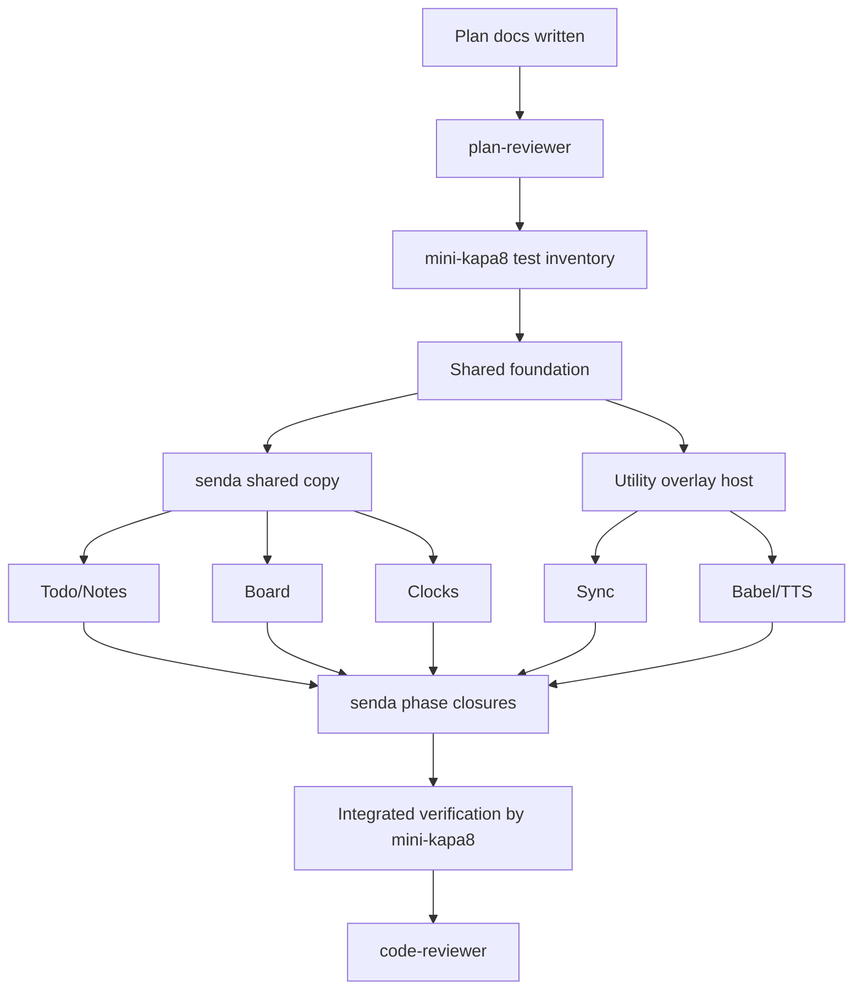

# UI CLI Parity Master Plan

> Planning-only document. Do not implement product code from this file until plan-reviewer has approved the plan set and mini-kapa8 has filled the test inventory sections.

**Goal:** Implement functional parity between the normal `ilu` CLI and `ilu ui` while keeping the UI migration scoped to `ui/` and preserving the CommonJS CLI.

**Architecture:** Build parity as coordinated UI-domain phases on top of a shared UI foundation. `ui/app.tsx` remains shell/runtime/delegation, page modules own domain UI behavior, action adapters call existing CommonJS models/services, and model mutators keep driving sync hooks.

**Tech stack:** Node.js CommonJS CLI, `tsx/cjs`, `ui/app.tsx`, TSX under `ui/`, Valyrian terminal primitives, existing `todos`, `notes`, `scrumban`, `clocks`, `sync`, `translate`, and `tts` modules.

---

## Scope

- Plan all UI work required for CLI parity for:
  - Todo tasks and todo lists;
  - Notes and note lists;
  - Board cards, columns, and board collection management;
  - Clocks list/add/remove/priority;
  - Sync init/status/retry/enable/disable;
  - Babel translation and dictionary display;
  - TTS file-to-audio and default voice selection.
- Define phase dependencies, owners, high-level acceptance, integration barriers, and expected validation classes.
- Create subplans under `docs/plans/` for each major domain.
- Add a shared-foundation subplan because every parity phase depends on shell/action-bar/state/snapshot contracts.

## Non-scope

- No product/code implementation in this planning phase.
- No concrete test inventory or test case enumeration; mini-kapa8 must fill reserved sections later.
- No commits or VCS operations that modify state.
- No `ui/app.js` shim.
- No repo-wide TypeScript, ESM, or Bun migration.
- No Inquirer removal.
- No root `ilu` default-to-TUI change.
- No content-aware column-width policy change.
- No manual sync runtime calls from TUI data mutators.

## Repo-first findings

- `package.json` exposes bin `ilu` from `./bin/cli.js`, uses `node --test`, and includes `@valyrianjs/terminal`, `valyrian.js`, and `tsx`.
- `bin/cli.js` registers `tsx/cjs` and requires `../ui/app.tsx` directly for `ilu ui`.
- `bin/configure-cli.js` shows the CLI feature surface for Todo, Notes, Board, Sync, Babel, Clocks, and TTS.
- `ui/app.tsx` currently composes the shell, top nav, footer, sync status, layout, headless/interactive sessions, and delegates Board to `ui/pages/board/MainView.tsx`.
- `ui/read-model.js` is read-only and currently provides limited Todo/Notes/Clocks snapshots and richer Board snapshots.
- `ui/board-actions.js` already adapts several Board card/column operations to safe result objects.
- `tests/ui-app.test.js`, `tests/ui-board-actions.test.js`, and `tests/ui-read-model.test.js` already encode important migration constraints.
- Existing git status is dirty from prior work; this plan only adds documentation files and does not commit.

Valyrian references consulted:

- `node_modules/@valyrianjs/terminal/llms-full.txt` for `Screen`, `Fixed`, `Overlay`, `FocusScope`, `Input`, `Editor`, `Button`, `List`, stable ids, state ownership, full-terminal layout, and session lifecycle.
- `node_modules/@valyrianjs/terminal/src/types.ts` for `Input`, `Editor`, `Button`, and `List` prop-level constraints relevant to planning.

## Current UI vs CLI coverage

| Domain | CLI normal | UI current | Parity gap |
| --- | --- | --- | --- |
| UI launcher | `ilu ui` opens TUI | implemented through `ui/app.tsx` | preserve only |
| Todo tasks | list/add/details/edit/show/check/remove | limited read/list text | CRUD, details, selection, check/uncheck, full list browsing |
| Todo lists | list/use/add/edit/remove | absent | list management and active list switching |
| Notes | list/add/details/edit/show/remove | limited read/list text | CRUD, details, content editor, full list browsing |
| Note lists | list/use/add/edit/remove | absent | list management and active list switching |
| Board cards | show/add/details/edit/move/priority/remove | mostly implemented | verify parity, multi-card move gap if needed, safe failure states |
| Board columns | add/reset default/rename/set WIP/default/move/remove | add/rename/move/remove implemented | reset default, set WIP, make default, constraints visibility |
| Boards | list/use/add/edit/remove | use/switch existing only | add/edit/remove and richer board collection management |
| Sync | init/status/retry/enable/disable | footer summary only | detailed operations and init form |
| Babel | translate/copy/dictionary | absent | utility workflow, clipboard result, dictionary display |
| Clocks | list/add/priority/remove | read list/footer only | add/remove/reorder, timezone search/validation |
| TTS | file-to-audio, voice selection | absent | utility workflow, secure config path, progress/result surfaces |

## Architecture and ownership

- `stack-planner` owns this plan set, dependency ordering, and final acceptance criteria.
- `plan-reviewer` owns read-only review of the written plans before test inventory or implementation.
- `mini-kapa8` owns filling each reserved test-inventory section, then implementing the approved plans.
- `senda` owns visible-copy validation before implementation and before phase closure for UI-touching phases.
- `code-reviewer` owns final diff/evidence review after implementation and integrated verification.
- `ui/app.tsx` ownership remains shell/runtime/delegation only; domain implementation owners must keep internals in page modules or focused UI adapters.
- Shared contracts (`AppState`, `UiSnapshot`, action-result shapes, action-bar slot, utility overlay host) are owned by the shared foundation phase and block domain implementation until stable.

## Probable files and areas

Master-level implementation will likely coordinate, but not necessarily edit, these areas:

- `ui/app.tsx`
- `ui/types.ts`
- `ui/read-model.js`
- `ui/components/*`
- `ui/pages/todos/*`
- `ui/pages/notes/*`
- `ui/pages/board/*`
- `ui/pages/clocks/*`
- New utility/adapters under `ui/` for Todo, Notes, Clocks, Sync, Babel, and TTS.
- Existing CommonJS domain modules under `todos/`, `notes/`, `scrumban/`, `clocks/`, `sync/`, `translate/`, and `tts/` as referenced contracts, not default rewrite targets.
- Existing tests under `tests/` after mini-kapa8 fills the reserved test inventories.

## Dependencies and relationship with other plans

- The shared foundation plan is the first implementation blocker because every subplan depends on state, snapshot, action-bar, overlay, and copy-gate contracts.
- Todo/Notes, Board, and Clocks can become parallel domain workstreams only after shared contracts are stable.
- Sync and Babel/TTS depend on the shared utility overlay/action surface and can conflict with each other if utility state is not split.
- All UI-touching phases depend on `senda` copy review before execution and before closure.
- Integrated verification must wait until all domain outputs are merged and barriers are resolved.

## Plan set

Required plans:

1. `docs/plans/2026-06-05-ui-cli-parity-master-plan.md`
2. `docs/plans/2026-06-05-ui-cli-parity-todo-notes-plan.md`
3. `docs/plans/2026-06-05-ui-cli-parity-board-plan.md`
4. `docs/plans/2026-06-05-ui-cli-parity-clocks-plan.md`
5. `docs/plans/2026-06-05-ui-cli-parity-sync-plan.md`
6. `docs/plans/2026-06-05-ui-cli-parity-babel-tts-plan.md`

Additional subplan created due cross-cutting risk:

7. `docs/plans/2026-06-05-ui-cli-parity-shared-foundation-plan.md`

## Master dependency tree

| Task | Type | Owner previsto | Touched areas | Depends on | Blocks | Can parallel with | Conflicts with | global_test_safe_parallel | Validation scope | Risk |
| --- | --- | --- | --- | --- | --- | --- | --- | --- | --- | --- |
| M-00 Plan-review gate | external-gate | plan-reviewer | `docs/plans/*.md` | plan docs written | all implementation | none | n/a | yes | plan review only | medium |
| M-01 Test inventory gate | external-gate | mini-kapa8 | every plan's reserved test section | M-00 | implementation | none | n/a | no | test inventory review | high |
| M-02 Shared foundation | blocker | mini-kapa8 | `ui/app.tsx`, `ui/types.ts`, `ui/read-model.js`, `ui/components/*` | M-01 | all domain phases | none | all UI shell work | no | shell/layout/type/read checks | high |
| M-03 Senda pre-implementation copy gates | external-gate | senda | planned shared/domain UI copy surfaces | M-02 design direction | M-04, M-05, M-06, M-07, M-08 | none | n/a | unknown | copy direction report | medium |
| M-04 Todo/Notes parity | dependent | mini-kapa8 | `ui/pages/todos/*`, `ui/pages/notes/*`, todo/note adapters | M-02, M-03 | M-10 | M-05 after contracts stable, M-06 after contracts stable | shared read model/action bar | no | domain UI/adapters | high |
| M-05 Board parity | dependent | mini-kapa8 | `ui/pages/board/*`, `ui/board-actions.js`, Board types | M-02, M-03 | M-10 | M-04 after contracts stable, M-06 after contracts stable | shell action-bar, shared Board state | no | Board UI/adapters | high |
| M-06 Clocks parity | dependent | mini-kapa8 | `ui/pages/clocks/*`, clock adapters | M-02, M-03 | M-10 | M-04 after contracts stable, M-05 after contracts stable | shared read model/action bar | no | clock UI/adapters | medium |
| M-07 Sync parity | dependent | mini-kapa8 | sync UI adapter/overlay, `sync/commands.js` integration | M-02, M-03 | M-10 | M-08 after utility host stable | shared utility overlay, footer status | no | sync UI with isolated HOME/remote | high |
| M-08 Babel/TTS parity | dependent | mini-kapa8 | utility overlay/page modules, translate/tts adapters | M-02, M-03 | M-10 | M-07 after utility host stable | shared utility overlay, secret handling | no | utility workflows | high |
| M-09 Per-phase `senda` closures | external-gate | senda | visible copy per phase | each domain implementation | M-10 | none | n/a | unknown | copy closure report | medium |
| M-10 Integrated verification | verification | mini-kapa8 | full repo relevant checks | M-04..M-09 | final review | none | all suites | no | node test/type/smoke selected by inventory | high |
| M-11 Code review handoff | verification | code-reviewer | final diff and evidence | M-10 | completion | none | n/a | yes | review evidence, not test execution | medium |

## Execution waves

- Wave 0: Write and plan-review all documents.
- Barrier 0: plan-reviewer must report whether plans are executable, scoped, and consistent. Critical findings must be incorporated before handoff.
- Wave 1: mini-kapa8 fills `

## Test inventory to be filled by mini-kapa8

Status: Filled by mini-kapa8 on 2026-06-05. This is an inventory for later implementation only; do not execute or implement these tests in the planning phase.

### Master test strategy

- **Primary risk:** cross-plan regressions in shared UI contracts: `ui/app.tsx` scope creep, top-nav expansion, footer overdraw, utility overlay collisions, manual sync runtime calls from data mutators, and unsafe secret/remote handling.
- **Local-wave rule:** each domain wave may run only its local subset after its code lands. Do not run global `node --test` during parallel waves.
- **Final integration rule:** run global and cross-domain checks only after Todo/Notes, Board, Clocks, Sync, Babel/TTS, and `senda` closure gates have joined the integration barrier.
- **Fixture rule:** any HOME, remote repo, file input, output audio, clipboard stub, or temp artifact mentioned by tests must live under `./tmp` inside the repo. If existing helpers still create OS temp folders, implementation should add or adapt a repo-local test helper before new parity tests use it.
- **External-call rule:** Sync, Babel, and TTS tests must use injectable fakes, local fixtures, or mocked providers. No real remotes, network calls, OpenAI calls, clipboard dependency, API keys, or real secrets are required.
- **Copy gate:** UI-visible assertions should be stable enough to catch user-facing regressions, but final wording still requires `senda` before implementation and before closure.

### Existing tests to modify or review

| File | Coverage purpose | Wave | Dependencies | Risk |
| --- | --- | --- | --- | --- |
| `tests/ui-app.test.js` | Preserve `ui/app.tsx` as real entrypoint, no `ui/app.js`, shell delegation, top nav, footer, overlays, 80x24, clickable visible actions. | Shared local, then final integration | Shared foundation first; domain UI tests after page modules exist | High |
| `tests/ui-read-model.test.js` | Enriched snapshots for Todo, Notes, Board, and Clocks without mutating models. | Shared/domain local | Shared snapshot contract | High |
| `tests/ui-board-actions.test.js` | Board adapter parity and safe action-result behavior. | Board local | Shared action result convention | High |
| `tests/sync-ilu-hooks.test.js` plus `tests/sync-*.test.js` | Debounce, flush-on-close, sync command safety, isolated remotes. | Sync local; full sync integration only at final barrier | Sync utility adapter and repo-local `./tmp` remote fixtures | High |
| `tests/tasks.test.js`, `tests/notes.test.js`, `tests/todo-lists.test.js`, `tests/note-lists.test.js`, `tests/clocks.test.js`, `tests/board*.test.js`, `tests/scrumban-model.test.js`, `tests/tts.test.js` | Domain model regression references; UI adapters must call these contracts rather than prompt flows. | Domain local as needed; final integration after merge | Existing CommonJS model behavior | Medium |

### New probable test files

| File | Coverage purpose | Wave | Fixtures / isolation | Risk |
| --- | --- | --- | --- | --- |
| `tests/ui-shared-foundation.test.js` | Shared action-result contract, action-bar slot, utility overlay host, `Esc`/`Ctrl+C` close order, no utility top-nav tabs. | Shared local | Headless UI/session fixtures only; no HOME mutation | High |
| `tests/ui-todo-actions.test.js` | Todo adapter validation, model calls, safe errors, list use/add/edit/remove, check/uncheck/remove. | Todo/Notes local | Model fakes; optional HOME fixtures under `./tmp` only | High |
| `tests/ui-note-actions.test.js` | Notes adapter validation, multiline content preservation, safe errors, note list use/add/edit/remove. | Todo/Notes local | Model fakes; optional HOME fixtures under `./tmp` only | High |
| `tests/ui-todo-notes-ui.test.js` | Todo/Notes visible controls, semantic `List` identity, overlays, empty/error states, Editor behavior. | Todo/Notes local, final visual integration | Headless terminal render; no coordinate math as primary assertion | High |
| `tests/ui-clock-actions.test.js` | Clock adapter validation, timezone checks, remove/reorder calls, safe errors. | Clocks local | Model fakes; no real HOME unless under `./tmp` | Medium |
| `tests/ui-clocks-ui.test.js` | Full Clocks page list/actions and footer regression without names at 80x24. | Clocks local, final footer integration | Headless render at 80x24 | High |
| `tests/ui-sync-actions.test.js` | Sync adapter status/retry/enable/disable/init contracts, confirmation, safe error redaction. | Sync local | Fake commands; repo-local `./tmp` remote fixtures only for explicit integration | High |
| `tests/ui-sync-ui.test.js` | Sync utility overlay, no top-nav tab, footer/debounce preservation, safe status details. | Sync local, final utility integration | Headless render; fake sync events | High |
| `tests/ui-babel-actions.test.js` | Babel adapter max length, language options, dictionary display data, fake clipboard result, safe failures. | Babel/TTS local | Fake provider and fake clipboard; no external service | Medium |
| `tests/ui-tts-actions.test.js` | TTS adapter preflight, missing credential handling, extension/path validation, voice persistence via fake service. | Babel/TTS local | Synthetic files under `./tmp`; fake TTS service; no API key, OpenAI, or ffmpeg | High |
| `tests/ui-babel-tts-ui.test.js` | Utility overlay workflows, Editor input, voice `List`, progress/result/error states, no secret `Input`. | Babel/TTS local, final utility integration | Headless render; fake adapters only | High |

### Final integration checks to schedule after all waves merge

- Run `node --test` only after parallel waves are integrated and no plan has pending shared contract edits.
- Run targeted UI smoke checks that render at 80x24 and assert no footer/action-bar/overlay overdraw.
- Re-run `senda` closure checks for visible copy before treating copy assertions as final.
- Keep `code-reviewer` as final diff/evidence reviewer only; do not assign it test execution.
