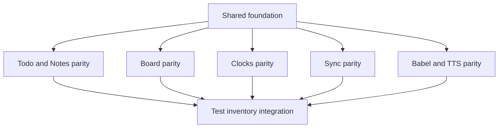

# UI CLI Parity Shared Foundation Plan

> Planning-only document. Do not implement product code from this file until the master plan has been reviewed and the mini-kapa8 test inventory section has been filled.

**Goal:** Establish the shared UI runtime, state, action-adapter, snapshot, layout, and validation contracts required by all CLI-parity subplans without moving domain internals into `ui/app.tsx`.

**Architecture:** Keep `ui/app.tsx` as shell/runtime/delegation. Add or evolve focused modules under `ui/` for shared app state, action results, page action bars, global utility overlays, and domain action adapters. Domain-specific workflow state and commands stay in page modules or domain-specific UI modules.

**Tech stack:** CommonJS CLI entrypoint, `tsx/cjs`, `ui/app.tsx`, Valyrian TSX, `@valyrianjs/terminal`, existing CommonJS models/actions.

---

## Scope

- Define the cross-cutting UI architecture needed by Todo, Notes, Board, Clocks, Sync, Babel, and TTS parity.
- Preserve `ui/app.tsx` as runtime/shell/delegation only.
- Define a generic user-facing action-result contract for UI mutators.
- Define snapshot enrichment rules that expose enough domain data for interactive UI without mutating models during reads.
- Define action-bar and overlay conventions that keep top nav limited to `Todo`, `Notes`, `Board`, `Clocks`.
- Define focus, escape/cancel, sync-flush, 80x24, and `senda` copy-validation gates shared by all subplans.

## Non-scope

- No product implementation.
- No root CLI rewrite, ESM conversion, Bun migration, or `ui/app.js` shim.
- No test inventory here; mini-kapa8 must fill the reserved section later.
- No sync runtime rewrite; UI must use existing mutators/hooks.
- No new top-nav entries for Sync, Babel, TTS, or any utility.

## Current UI vs CLI state

Observed repo state:

- CLI loads `ui/app.tsx` through `tsx/cjs` from `bin/cli.js`; `ui/app.js` must remain absent.
- `ui/app.tsx` owns shell/runtime, global tab commands, help overlay, sync status subscription, layout sizing, and mounted/headless sessions.
- Non-Board tabs currently render read-only text through `ui/pages/todos/MainView.tsx`, `ui/pages/notes/MainView.tsx`, and `ui/pages/clocks/MainView.tsx`.
- Board already has a richer page module under `ui/pages/board/` and action adapter in `ui/board-actions.js`.
- `ui/read-model.js` currently limits Todo/Notes/Clocks to a small read snapshot and exposes richer Board data.
- Existing tests enforce app-shell delegation, no `ui/app.js`, no Board internals in `ui/app.tsx`, `mergeTerminalTheme`, sync debounce/flush, and 80-column footer constraints.

Valyrian planning references consulted:

- `node_modules/@valyrianjs/terminal/llms-full.txt` describes `mountTerminal`, `renderTerminal`, state ownership outside renderer, stable ids, `List`, `Overlay`, `FocusScope`, `Fixed`, and full-terminal layout.
- `node_modules/@valyrianjs/terminal/src/types.ts` confirms current `Input` props expose value/placeholder/change/submit events but no masked/secret input prop. This affects TTS API-key handling.

## Proposed architecture and ownership

### Shell/runtime boundary

`ui/app.tsx` should continue to own only:

- runtime import/registration and session creation;
- top-level `AppRuntimeState` composition;
- top nav chrome with exactly `Todo`, `Notes`, `Board`, `Clocks`;
- global keymap fallback for tab switch, `Esc`, and `Ctrl+C`;
- shell layout dimensions and sync status subscription/flush;
- delegation to page modules and shared utility overlays.

It should not contain:

- Todo/Notes/Board/Clocks CRUD logic;
- Sync command internals;
- Babel/TTS service internals;
- domain-specific overlay state machines beyond delegating a shared global overlay registry.

### Shared UI state

Extend the UI state model by composition, not flattening:

- `AppState.board` remains Board-specific.
- Add per-domain runtime substates as separate objects when needed, for example Todo, Notes, Clocks, Sync, Utilities, Babel, and TTS.
- Keep domain substates normalized in their page/controller modules.
- Keep residual `__focused` usage only for headless/tests until a safe public replacement exists.

### Shared action result contract

Each domain action adapter should return safe UI results:

- success result with minimal refreshed domain identifiers;
- safe user-facing error string;
- no raw exception text, file paths, secrets, remote URLs beyond what user typed, or internal model details.

### Shared layout/action bars

- Top nav remains app chrome only: `Todo`, `Notes`, `Board`, `Clocks`.
- Introduce or generalize a contextual action bar row above the fixed footer.
- Board keeps its contextual action bar semantics and fixed placement above footer.
- Non-Board pages use the same action-bar slot for visible actions.
- Sync/Babel/TTS enter through visible action(s) without adding top-nav tabs; recommended shared surface is a compact `Tools`/`Sync` access point in the action-bar row, with page-specific action bars still prioritized.
- Maintain 80x24 without overdraw; any overlay must be bounded with `Overlay` margin and clipped content.

### Shared Valyrian interaction rules

- Use public primitives and semantic events (`Button`, `List`, `Input`, `Editor`, `Overlay`, `FocusScope`, `Fixed`, `Pane`, `Split`, `ScrollView` when needed).
- Give every durable interactive primitive a stable id.
- Prefer `List` `itemKey`/event payload identity over coordinate math.
- Coordinate helpers such as `clickAt` remain secondary for adapter-level tests or mouse integration, not primary app behavior.
- `Esc` closes active overlays before exit; `Ctrl+C` preserves cancel/exit semantics.

### Sync rule

- UI mutators call existing model/domain mutators only.
- Do not call sync runtime manually after mutating user data.
- Existing model hooks drive sync; TUI debounce remains 5s; direct CLI remains immediate; pending sync flushes on close.

### Copy validation rule

Before implementation of any UI-visible phase, and again before closing that phase, route visible copy through `senda` review. Copy must be direct user-facing UI language and must not expose internal contracts, route names, ids, filenames, agents, plan taxonomy, or acceptance criteria.

## Probable files and areas

- `ui/app.tsx`
- `ui/types.ts`
- `ui/read-model.js`
- `ui/components/AppShell.tsx`
- `ui/components/Footer.tsx`
- `ui/components/Button.tsx`
- `ui/components/Overlay.tsx`
- `ui/components/TopNav.tsx`
- New shared UI modules under `ui/` or `ui/components/` as needed by implementation.
- New/expanded page modules under `ui/pages/*`.
- Existing tests under `tests/ui-*.test.js` and domain tests under `tests/*.test.js` for verification only after mini-kapa8 fills inventory.

## Dependencies and relationship with other plans

This foundation blocks all functional parity plans because they need shared state shape, action adapters, action bar placement, overlay conventions, and snapshot enrichment.

## Dependency tree

| Task | Type | Owner previsto | Touched areas | Depends on | Blocks | Can parallel with | Conflicts with | global_test_safe_parallel | Validation scope | Risk |
| --- | --- | --- | --- | --- | --- | --- | --- | --- | --- | --- |
| SF-00 Senda pre-implementation shared copy gate | external-gate | senda | planned shared UI copy surfaces | plan-review and mini-kapa8 inventory | SF-04, SF-06, downstream copy | none | n/a | unknown | copy direction report | medium |
| SF-01 Map shared shell constraints | blocker | stack-planner then mini-kapa8 | `ui/app.tsx`, `ui/components/*`, `ui/types.ts` | none | all subplans | none | all UI shell edits | no | Static source review and app-shell smoke | medium |
| SF-02 Define shared domain state composition | blocker | mini-kapa8 | `ui/types.ts`, page state modules | SF-01 | all domain pages | none | every page state edit | no | Typecheck and headless session state checks | high |
| SF-03 Define shared action result convention | blocker | mini-kapa8 | `ui/*-actions.js`, future adapters | SF-01 | domain mutators | none | domain adapters if contract changes mid-wave | no | Adapter-level checks | medium |
| SF-04 Generalize action-bar slot | blocker | mini-kapa8 | `ui/components/AppShell.tsx`, `ui/app.tsx`, page outputs | SF-00, SF-01 | all visible CRUD actions | none | Board action bar and footer layout | no | 80x24 render checks | high |
| SF-05 Enrich read snapshot shape safely | blocker | mini-kapa8 | `ui/read-model.js`, `ui/types.ts` | SF-02 | page lists/details | none | all domain snapshot consumers | no | Snapshot read-only checks | high |
| SF-06 Define global utility overlay host | dependent | mini-kapa8 | `ui/app.tsx`, utility page modules | SF-00, SF-02, SF-04 | Sync/Babel/TTS | Todo/Notes/Clocks page internals after host stable | shared overlay state | no | Overlay focus and Esc/Ctrl+C checks | medium |
| SF-07 Senda closure copy gate | external-gate | senda | all implemented user-visible copy surfaces | SF-04, SF-06 | phase closures | none | n/a | unknown | Copy closure report | medium |
| SF-08 Integrated shell verification | verification | mini-kapa8 | full UI test scope | SF-01..SF-07 | downstream implementation waves | none | all global suites | no | Global UI smoke/type/test commands | medium |

## Execution waves

- Wave 0: Confirm this foundation plan and master plan with `plan-reviewer`.
- External gate before implementation: SF-00 sends planned shared copy direction to `senda` before any shell/action-bar/overlay copy is implemented.
- Wave 1: SF-01, SF-02, SF-03 as one semantic unit because state and action-result contracts influence all later pages.
- Barrier: update all subplan dependency tables if implementation discovers a different shared state or action-result shape.
- Wave 2: SF-04 and SF-05; do not start page CRUD work until action-bar and snapshot contracts are stable.
- Barrier: run shell/layout verification selected by mini-kapa8 inventory; confirm no 80x24 regression.
- Wave 3: SF-06 utility overlay host.
- External closure gate: `senda` validates implemented visible shared copy before downstream UI phases close.
- Final foundation barrier: mini-kapa8 records evidence, then implementation can split by domain plans.

## Integration barriers

- No domain page may add hidden key-only behavior as the only path to a CLI-equivalent operation.
- No downstream plan may add a new top-nav item.
- Any change to `AppState`, `UiSnapshot`, or action-result shape must be reflected in all dependent subplans before coding continues.
- Any change affecting `ui/app.tsx` must pass the delegation rule: shell/runtime/delegation only.
- Any overlay host change must preserve active overlay close behavior for `Esc` and `Ctrl+C`.

## Copy visible and `senda` validation

Visible shared surfaces:

- top nav labels;
- action-bar labels;
- global utility entry labels;
- help overlay;
- footer sync status and exit hint;
- generic empty/error/success messages;
- overlay confirm/cancel labels.

Plan requirement: schedule `senda` before implementation and before phase closure for each UI-touching wave. The copy review must check that labels are concise, user-facing, and do not expose internal plan names, route names, ids, files, agents, or implementation contracts.

## Risks and decisions not taken

- `Input` currently has no masked-secret prop in the source types; TTS API-key capture in the TUI is a security-sensitive gap.
- A generic action bar can create vertical pressure at 80x24; Board already has an action bar and must not overdraw footer.
- Snapshot enrichment can become too broad; keep it scoped to data needed for visible UI and selected item identity.
- Multiple domain pages may want shared helpers; avoid one-line helpers or abstractions unless there are at least three uses or a clear external contract.
- If implementation requires a larger page-state machine, keep it per domain rather than centralizing in `ui/app.tsx`.

## High-level acceptance criteria

- `ui/app.tsx` remains the TUI entrypoint and does not become a domain-logic file.
- Top nav remains exactly `Todo`, `Notes`, `Board`, `Clocks`.
- Shared action-bar/overlay placement works at 80x24 without footer overdraw.
- Domain pages can expose visible/clickable actions with keymaps only as fallback.
- `Esc` and `Ctrl+C` behavior remains consistent across shared and domain overlays.
- User-visible shared copy has a recorded `senda` validation before implementation and before phase closure.
- No manual sync runtime calls are introduced in UI mutators.

## Test inventory to be filled by mini-kapa8

Status: Filled by mini-kapa8 on 2026-06-05. This is an inventory for later implementation only; do not execute or implement these tests in the planning phase.

### Tests to modify or review

| File | Purpose of coverage | Wave | Fixtures / isolation | Risk |
| --- | --- | --- | --- | --- |
| `tests/ui-app.test.js` | Extend shell guards: `ui/app.tsx` remains the entrypoint, `ui/app.js` remains absent, `tsx/cjs` load stays direct, `ui/app.tsx` delegates domain internals, top nav remains exactly `Todo`, `Notes`, `Board`, `Clocks`. | Shared local | Source/static checks plus headless app import only | High |
| `tests/ui-app.test.js` | Add render checks for shared action-bar slot above footer, footer fixed at bottom, no overdraw at 80x24, utility overlay bounded with margin. | Shared local and final integration | Headless terminal render at 80x24; no real HOME | High |
| `tests/ui-app.test.js` | Add interaction checks for `Esc` closing the active overlay before app exit and `Ctrl+C` preserving cancel/exit semantics. | Shared local | Headless session; semantic ids/events over coordinate helpers | High |
| `tests/ui-read-model.test.js` | Extend snapshot contract tests so enriched Todo/Notes/Board/Clocks data remains read-only and never calls mutators. | Shared local, then domain local | Injected fake models whose mutators throw | High |
| `tests/sync-ilu-hooks.test.js` | Review existing debounce/flush assumptions so foundation changes do not break close-time flush. | Shared local and Sync local | Fake timers/events only | Medium |

### Tests to create

| File | Purpose of coverage | Wave | Fixtures / isolation | Risk |
| --- | --- | --- | --- | --- |
| `tests/ui-shared-foundation.test.js` | Validate shared action-result shape: `{ok: true}` success variants and `{ok: false, error: <safe user copy>}` failure variants, with no raw exception text, local paths, secrets, stack traces, or remote internals. | Shared local | Pure functions/fakes; no HOME mutation | High |
| `tests/ui-shared-foundation.test.js` | Validate utility overlay host state: only one active utility overlay, utility entry does not add top-nav tabs, focus is trapped for modal overlays, close returns to prior page state. | Shared local | Headless UI/session fixtures | High |
| `tests/ui-shared-foundation.test.js` | Validate shared action-bar contract accepts page-specific visible actions and utility actions without hiding primary page actions. | Shared local | Render fixture with fake pages | Medium |
| `tests/ui-shared-foundation.test.js` | Static guard that no UI mutator adapter calls sync runtime manually after Todo/Notes/Board/Clocks data mutations. | Shared local and final integration | Source scan limited to `ui/` adapters; no command execution | High |

### Dependencies and gates

- Read `node_modules/@valyrianjs/terminal/llms-full.txt` before touching Valyrian terminal code; consult `node_modules/@valyrianjs/terminal/src` if implementation details affect `Overlay`, `FocusScope`, `List`, `Button`, `Input`, or `Fixed` tests.
- `senda` must review planned shared copy before implementation and final visible shared copy before closure.
- Shared tests block Todo/Notes, Board, Clocks, Sync, and Babel/TTS local tests because they define state, overlay, action-bar, and snapshot contracts.
- Any shared fixture, HOME substitute, local file, or temporary artifact introduced by later tests must be rooted under `./tmp` inside the repo.

### Final integration checks

- Re-run shared foundation tests after every domain plan joins integration because `ui/app.tsx`, `ui/types.ts`, and `ui/read-model.js` are shared blast-radius files.
- Run global `node --test` only after all domain waves are integrated.
