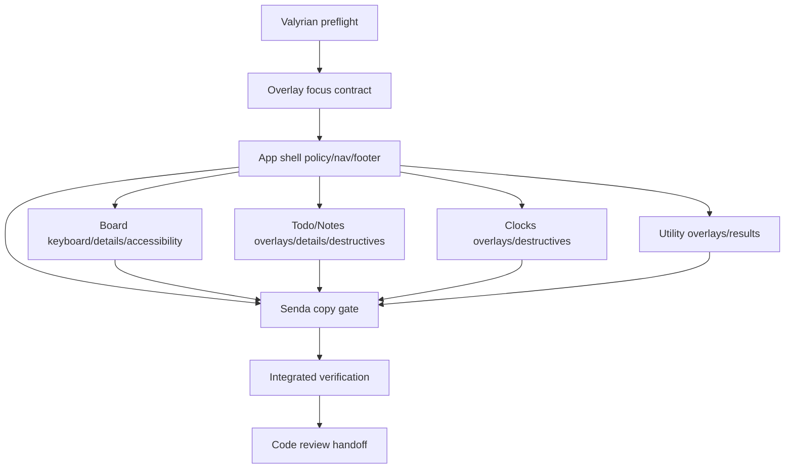

# UI Accessibility/UX Fixes Implementation Plan

> **For agentic workers:** REQUIRED SUB-SKILL: use `subagent-driven-development` or `executing-plans` to implement this plan task-by-task. Implementation owner should be `mini-kapa8`; copy review gate should be `senda` where visible UI text changes.

**Goal:** Implement the accepted accessibility/UX fixes across the TSX TUI without changing the CLI architecture or reviving removed shims.

**Architecture:** Keep the work inside `ui/` and UI-focused tests. Use shared overlay/shell primitives where possible, preserve `ui/app.tsx` as the real entrypoint, and avoid broad refactors beyond the accepted findings.

**Tech Stack:** CommonJS CLI, `tsx/cjs` registration for `ui/app.tsx`, Valyrian terminal primitives from `@valyrianjs/terminal`, Node's built-in test runner.

---

## Alcance

- Board keyboard parity:
  - `Enter` opens card details from focused `board-card-list-*` lists.
  - `Space` is defined safely and does not trigger destructive or ambiguous actions.
- Generic overlay initial focus via `initialFocusId` for Todo, Notes, Clocks, Sync, Translate, Speech, and Board overlays where a stable first control/input exists.
- App switch policy while an overlay is open: close overlays explicitly when changing app/tab, including page overlays and utility overlays, to avoid latent state.
- `ScrollView` for long details/result overlays while preserving fixed `bottomNav`.
- Consistent destructive states and safe English copy.
- Selection/focus is not represented by color alone where the visible marker is currently missing.
- Footer/help reflects real contextual shortcuts.
- Top nav visually groups primary apps and utilities as `Todo Notes Board Clocks | Sync Translate Speech` without reintroducing Tools.

## No-alcance

- Do not revive `ui/app.js`.
- Do not convert the repo to TypeScript-only, ESM, or Bun.
- Do not change the CommonJS CLI.
- Do not move root `ilu` behavior to the TUI.
- Do not reintroduce `Tools`, `Current list`, or `Switch to board` visible copy.
- Do not change board column width policy or implement content-aware widths.
- Do not add manual sync runtime calls from UI mutators.
- Do not run product tests or commit from this planning task. Implementation agents may run focused verification per this plan.

## Repo findings used for this plan

- `package.json` exposes Node's built-in test runner at the repo root and depends on `@valyrianjs/terminal`, `valyrian.js`, and `tsx`.
- `ui/app.tsx` owns app tabs, global keymap, tab switching, shell composition, and help overlay.
- `ui/components/Overlay.tsx` provides the shared `AppOverlay` slots: `title`, `topNav`, `content`, and `bottomNav`.
- `ui/components/Footer.tsx` currently renders a generic `Ready/Ctrl+C: Exit`-style footer line.
- UI views are split under `ui/pages/{todos,notes,clocks,board}/MainView.tsx` and utilities under `ui/components/UtilityHost.tsx`.
- Existing UI tests live in `tests/ui-*.test.js`; `ui/app-shell-contract.test.ts` also exists under `ui/`.
- Valyrian docs confirm `Overlay`, `FocusScope`, `List`, and `ScrollView` are public primitives; `ScrollView` supports focused `UP`/`DOWN` scrolling and a `height` viewport.

## Archivos probables

- `ui/app.tsx`
  - tab switch policy, global overlay close orchestration, help overlay content, contextual footer inputs, top nav grouping call site.
- `ui/components/TopNav.tsx`
  - visual grouping separator between primary apps and utilities.
- `ui/components/Footer.tsx`
  - contextual help/footer labels and width clipping.
- `ui/components/Overlay.tsx`
  - generic `initialFocusId` pass-through and optional scrollable content support if shared helper is appropriate.
- `ui/pages/board/MainView.tsx`
  - board list keyboard behavior, board overlay initial focus, long card details scroll, destructive state/copy, selection markers.
- `ui/pages/board/BoardColumn.tsx` and possibly `ui/pages/board/BoardCard.tsx`
  - visible non-color selection markers for board cards/lists.
- `ui/pages/todos/MainView.tsx`
  - overlay initial focus, long task details scroll, destructive copy/state, visible selection markers if missing.
- `ui/pages/notes/MainView.tsx`
  - overlay initial focus, long note details scroll, destructive copy/state, visible selection markers if missing.
- `ui/pages/clocks/MainView.tsx`
  - overlay initial focus and destructive copy/state.
- `ui/components/UtilityHost.tsx`
  - Sync/Translate/Speech initial focus and scrollable result/detail regions.
- `ui/types.ts`
  - only if state shape needs a typed overlay focus field or contextual footer metadata.
- `tests/ui-app.test.js`
  - app switch policy, top nav grouping, help/footer assertions.
- `tests/ui-todo-notes-ui.test.js`
  - Todo/Notes initial focus, scroll details, destructive copy/state, marker assertions.
- `tests/ui-clocks-ui.test.js`
  - Clocks initial focus and destructive state/copy assertions.
- `tests/ui-sync-ui.test.js`
  - Sync initial focus and overlay close on app switch.
- `tests/ui-babel-tts-ui.test.js`
  - Translate/Speech initial focus and result scroll assertions.
- Board-focused tests currently appear mainly inside `tests/ui-app.test.js`; keep additions there unless an existing board-specific UI test file is introduced by implementation.

## Dependency table

| Task | Type | Owner | Touched areas | Depends on | Blocks | Can parallel with | Conflicts with | global_test_safe_parallel | Validation scope | Risk |
| --- | --- | --- | --- | --- | --- | --- | --- | --- | --- | --- |
| T0 Valyrian preflight | blocker | mini-kapa8 | `node_modules/@valyrianjs/terminal/llms-full.txt`, `node_modules/@valyrianjs/terminal/src` if needed | none | T1-T7 | none | none | yes | Evidence note in implementation summary | low |
| T1 Overlay focus contract | blocker | mini-kapa8 | `ui/components/Overlay.tsx`, overlay consumers | T0 | T2, T3, T4 | none | all overlay tasks | no | focused overlay tests by id | medium |
| T2 App shell policy/nav/footer | dependent | mini-kapa8 | `ui/app.tsx`, `TopNav.tsx`, `Footer.tsx`, `tests/ui-app.test.js` | T1 | T3-T7 integration | T4 if file ownership split is strict | `ui/app.tsx` with overlay consumers | no | app tests for tab switch, nav grouping, help/footer | medium |
| T3 Board keyboard/details/accessibility | dependent | mini-kapa8 | `ui/pages/board/*`, board UI tests | T1, T2 policy decision | V1 | T5, T6, T7 after T2 | possible shared overlay helpers | no | board card list Enter/Space, details scroll, markers | high |
| T4 Todo/Notes overlays/details/destructives | dependent | mini-kapa8 | `ui/pages/todos/MainView.tsx`, `ui/pages/notes/MainView.tsx`, `tests/ui-todo-notes-ui.test.js` | T1, T2 policy decision | V1 | T5, T6, T7 | shared overlay helpers | no | Todo/Notes focus, scroll, markers, destructive copy | medium |
| T5 Clocks overlays/destructives | dependent | mini-kapa8 | `ui/pages/clocks/MainView.tsx`, `tests/ui-clocks-ui.test.js` | T1, T2 policy decision | V1 | T3, T4, T6, T7 | shared overlay helpers | no | Clocks focus and destructive state/copy | low |
| T6 Utility overlays/results | dependent | mini-kapa8 | `ui/components/UtilityHost.tsx`, `tests/ui-sync-ui.test.js`, `tests/ui-babel-tts-ui.test.js` | T1, T2 policy decision | V1 | T3, T4, T5, T7 | shared overlay helpers | no | Sync/Translate/Speech focus, scroll, app switch close | medium |
| T7 Senda copy gate | external-gate | senda | visible UI copy in changed files | T2-T6 drafts | V1 | none | all visible copy changes | yes | copy checklist approval | low |
| V1 Integrated verification | verification | mini-kapa8 | UI test subset, optional type/smoke checks | T3-T7 | code review | none | all implementation files | no | evidence from focused UI suites and, if warranted, root runner | medium |
| R1 Code review handoff | verification | code-reviewer | final diff + evidence | V1 | done | none | none | yes | review findings only; no test ownership | low |

## Dependency DAG

## Execution waves

### Wave 0 — Preflight and contracts

1. `mini-kapa8` reads `node_modules/@valyrianjs/terminal/llms-full.txt` before changing Valyrian terminal code.
2. If `initialFocusId`, `ScrollView`, key bindings, or `Overlay` behavior are unclear from `llms-full.txt`, `mini-kapa8` consults `node_modules/@valyrianjs/terminal/src` as the source of truth.
3. Confirm implementation remains inside `ui/` plus UI tests; no CLI/root conversion.

**Barrier B0:** Implementation summary must state that Valyrian preflight was done before UI primitive changes.

### Wave 1 — Shared overlay and app-shell decisions

1. Add/verify a shared overlay focus path so each overlay can request a stable initial focus id without local ad-hoc session calls.
2. Choose the accepted app switch policy: close all overlays explicitly on app/tab change.
3. Apply that policy consistently to:
   - app-level help overlay,
   - Todo/Notes/Clocks page overlays,
   - Board overlays,
   - utility overlays under Sync/Translate/Speech.
4. Update top nav grouping to show `Todo Notes Board Clocks | Sync Translate Speech`.
5. Update footer/help copy so it reflects real available shortcuts and active context.

**Barrier B1:** No downstream page work starts until the overlay focus contract and tab-switch close policy are settled, because every page overlay depends on them.

### Wave 2 — Page and utility implementation

For this session, execute Wave 2 serially or semi-serially under `mini-kapa8` ownership to reduce context and shared-pattern conflicts. Do not split Wave 2 across multiple implementation agents unless the plan is revised first with strict non-overlapping owners and a new integration barrier.

1. **Board:** implement `Enter` to open card details from focused `board-card-list-*`; define `Space` as safe and non-destructive. Add scrollable card details where long content can exceed the viewport. Add visible selection markers where color alone is currently relied on. Align destructive remove/delete states and copy.
2. **Todo/Notes:** add initial focus ids for all applicable overlays. Add `ScrollView` to long task/note details while preserving `bottomNav`. Normalize destructive states and copy. Add non-color markers where selection/focus needs visible text.
3. **Clocks:** add initial focus ids and make destructive remove copy/state consistent with the rest of the UI.
4. **Utilities:** add initial focus ids for Sync init, Translate, Speech/voice chooser where applicable. Wrap long Sync details, Translate results/dictionary, and Speech result/help surfaces in scrollable content while preserving fixed bottom controls where present.

**Barrier B2:** Collect all changed visible strings for the copy gate before integrated verification.

### Wave 3 — Copy gate, verification, and review handoff

1. `senda` reviews changed UI-visible English copy only.
2. `mini-kapa8` runs focused UI verification after all Wave 2 changes are integrated and returns evidence identifying which UI suites or scenarios were exercised and their pass/fail status.
3. If focused verification passes and changes touched broad app-shell behavior, `mini-kapa8` may also run the repo root test runner once and return the resulting evidence.
4. Hand final diff and test evidence to `code-reviewer`; reviewer should inspect accessibility/UX gaps and evidence, not own test execution.

## Barriers

- **B0 Valyrian docs barrier:** No implementation touching Valyrian primitives until `llms-full.txt` is read; consult `src` if public docs are insufficient.
- **B1 Overlay policy barrier:** Decide and implement the shared overlay close/focus behavior before per-page overlays; otherwise page agents may duplicate incompatible patterns.
- **B2 Shared-file barrier:** Do not parallelize edits to `ui/app.tsx`, `Overlay.tsx`, `Footer.tsx`, or `TopNav.tsx` across agents.
- **B3 Copy gate:** Any changed visible UI text must pass the senda copy checklist before final verification.
- **B4 Verification barrier:** Global tests wait until all implementation and copy-gate changes are integrated.

## TDD / validation plan

### Red checks to add first

- Board focused `board-card-list-*` + `Enter` opens card details for the active card.
- Board focused `board-card-list-*` + `Space` follows the chosen safe behavior and does not delete, move, or silently mutate cards.
- Opening representative overlays focuses the expected first control/input by id:
  - Todo add/edit/remove/list overlays,
  - Notes add/edit/remove/list overlays,
  - Clocks add/remove overlays,
  - Sync init overlay,
  - Translate main input/result area where applicable,
  - Speech/voice chooser where applicable,
  - Board add/edit/move/priority/details/menu/remove overlays where applicable.
- Switching tabs while any overlay is open closes that overlay and does not leak the old overlay state when switching back.
- Long task/note/card details and utility result/details render without lines longer than 80 columns at `80x24`, keep bottom controls visible, and are scrollable via keyboard when focused.
- Destructive controls consistently expose danger/error state and safe labels.
- Visible selected/current markers exist where selection is otherwise color-only.
- Footer/help assertions match actual key bindings and context.
- Top nav line includes `Todo`, `Notes`, `Board`, `Clocks`, a visible separator, then `Sync`, `Translate`, `Speech`; it does not include `Tools`.

### Focused verification evidence for implementation

After the corresponding files are changed, `mini-kapa8` must return evidence for the relevant focused UI coverage areas:

- app shell behavior: tab switch overlay closing, nav grouping, help/footer copy, and app-shell contract coverage;
- Todo/Notes behavior: initial focus, scrollable details, destructive copy/state, and visible marker coverage;
- Clocks behavior: initial focus and destructive state/copy coverage;
- Sync behavior: initial focus and overlay close on app switch coverage;
- Translate/Speech behavior: initial focus and result/help scroll coverage;
- Board behavior: card-list `Enter`/`Space`, details scroll, destructive copy/state, and visible marker coverage.

After integration, if focused verification passes and app-shell changes are broad, `mini-kapa8` should return evidence from one root-level test-runner pass.

Evidence should include: scope exercised, pass/fail status, any failing test or scenario names, and a short reason for skipped coverage if any expected area cannot be exercised.

## Copy gates de senda

Visible UI copy must be English, direct for the end user, and must not expose implementation vocabulary.

Checklist:

- No internal/spec language: no `adapter`, `snapshot`, `runtime`, `criteria`, `agent`, file paths, ids, or implementation taxonomies.
- No old rejected labels: no `Tools`, `Current list`, or `Switch to board`.
- Destructive labels are explicit and safe:
  - primary destructive action uses a danger/error visual state,
  - confirmation copy says the action cannot be undone when true,
  - confirmation button text is specific, e.g. `Delete board`, `Remove note`, `Remove clock`.
- Keyboard/help copy reflects actual bindings only; do not advertise a shortcut unless it is implemented and tested.
- Overlay text should guide the current task, not document the plan.
- Keep labels short enough for `80x24`; long details belong in scrollable content, not wider lines.

## Criterios de aceptación observables

- At `80x24`, no visible line exceeds 80 columns in the affected screens/overlays.
- Top nav displays the primary/utility grouping separator and does not show `Tools`.
- With focus on a Board card list, `Enter` opens card details for the selected/active card.
- With focus on a Board card list, `Space` produces only the chosen safe behavior and never triggers deletion/move/priority changes.
- Opening each changed overlay places focus on the intended first control/input/list.
- Switching tabs closes open overlays; returning to the prior tab does not resurrect the old overlay.
- Long details/results can scroll while bottom navigation/actions remain visible.
- Destructive controls are visually marked with danger/error state and use safe explicit English labels.
- Selection/current state has a visible textual marker where color is not sufficient.
- Footer/help text changes with context and matches real key bindings.
- Focused UI verification evidence listed above passes, or any failure is documented with the failing suite/scenario and reason.

## Riesgos

- `initialFocusId` may not be a direct public prop on the current Valyrian primitive. Mitigation: verify in `llms-full.txt` and `src`; if unavailable, implement a small app-layer pending-focus contract without broad renderer changes.
- App-wide overlay close policy may require touching multiple page state shapes. Mitigation: centralize the policy in app-shell orchestration and keep per-page close helpers narrow.
- `ScrollView` focus can compete with buttons in `bottomNav`. Mitigation: preserve `bottomNav` outside the scrollable region and give scrollable regions stable ids.
- Board list `Enter`/`Space` may overlap built-in list activation behavior. Mitigation: use semantic list events/identity and avoid coordinate math or `clickAt` as the primary behavior.
- Top nav grouping could overdraw at 80 columns if spacing is too loose. Mitigation: test at `80x24` and keep the separator compact.
- Copy churn can break existing approved-copy assertions. Mitigation: update tests only for accepted copy changes and run the copy gate before global verification.
