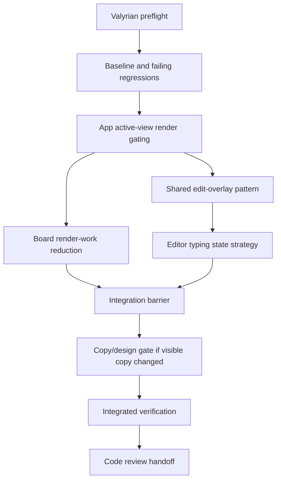

# UI Editor Performance and Edit Pattern Implementation Plan

> **For agentic workers:** REQUIRED SUB-SKILL: use `subagent-driven-development` or `executing-plans` to implement this plan task-by-task. Implementation owner should be `mini-kapa8`; design/copy review gate should be `stack-designer` or `senda` if visible UI copy changes.

**Goal:** Make typing in TUI editors feel responsive and align Todo, Notes, and Board edit overlays around one shared editing pattern without broadening the TSX migration or changing CLI architecture.

**Architecture:** Keep changes inside `ui/` plus focused UI tests. Separate the performance fix into app/render gating and Board render-work reduction, then normalize edit overlays through a shared UI contract that preserves domain-specific fields. Avoid a broad Valyrian abstraction unless the terminal docs/source prove it is required.

**Tech Stack:** CommonJS CLI loading `ui/app.tsx` through `tsx/cjs`, Valyrian terminal primitives from `@valyrianjs/terminal`, Valyrian.js TSX views, Node built-in test runner.

---

## Alcance

- Reduce useless rendering while typing in `Editor` controls used by Todo task details, Notes content, and Board card descriptions.
- Prevent non-active page render work from being rebuilt on every app render, especially Board when the active tab is Todo or Notes.
- Avoid heavy Board card/list wrapping work on renders where Board output is not needed or where the relevant Board inputs did not change.
- Create one shared edit-overlay pattern for Todo task forms, Notes forms, and Board card forms:
  - title/header area;
  - title input when the domain requires it;
  - primary editor that uses available space;
  - consistent error placement/state;
  - fixed `bottomNav` with `Save` and `Cancel` where editing is confirmed;
  - direct English user copy.
- Preserve valid domain differences: task details vs note content vs board card description, required-title rules, placeholders, destructive flows, focus behavior, and Board-specific sizing constraints.
- Add focused regression coverage for render gating, editor typing responsiveness behavior, Board render-work avoidance, edit overlay consistency, and `80x24` no-overdraw.

## No-alcance

- Do not revive `ui/app.js`.
- Do not convert the repo to TypeScript-only, ESM, or Bun.
- Do not change the CommonJS CLI or root command behavior.
- Do not move root `ilu` behavior to the TUI.
- Do not remove Inquirer.
- Do not change Board column width policy or implement content-aware widths.
- Do not add manual sync runtime calls from UI mutators.
- Do not reintroduce `Tools`, `Current list`, `Switch to board`, or `Selected board: ...` visible copy.
- Do not replace semantic card events/identity with coordinate math or `clickAt`-style patches as the primary interaction contract.
- Do not perform VCS-mutating commands.

## Repo findings used for this plan

- `package.json` defines the root runner through Node's built-in test system and depends on `@valyrianjs/terminal`, `valyrian.js`, and `tsx`.
- `ui/app.tsx` currently constructs Todo, Notes, Clocks, and Board view objects during each `App()` render before selecting the active panel and overlays.
- Todo and Notes edit forms use controlled `Editor` values from form state in `ui/pages/todos/MainView.tsx` and `ui/pages/notes/MainView.tsx`.
- Board edit card uses a controlled `Editor` value from `state.editCard` in `ui/pages/board/MainView.tsx`.
- `AppOverlay` in `ui/components/Overlay.tsx` already exposes `title`, `topNav`, `content`, and `bottomNav`; `bottomNav` is rendered in a fixed bottom region.
- Board card list item generation in `ui/pages/board/BoardColumn.tsx` wraps every card label through `wrapText`, making Board renders comparatively expensive.
- Existing UI tests load `ui/app.tsx` through `tsx/cjs` and include headless/interactive coverage in `tests/ui-app.test.js`, `tests/ui-todo-notes-ui.test.js`, and related UI suites.

## Dependency tree

| Task | Type | Owner | Touched areas | Depends on | Blocks | Can parallel with | Conflicts with | global_test_safe_parallel | Validation scope | Risk |
| --- | --- | --- | --- | --- | --- | --- | --- | --- | --- | --- |
| T0 Valyrian preflight | blocker | mini-kapa8 | `node_modules/@valyrianjs/terminal/llms-full.txt`, `node_modules/@valyrianjs/terminal/src` if needed | none | T1-T5 | none | none | yes | Implementation notes state terminal docs/source were consulted before changes touching `Editor`, render, focus, or layout primitives | low |
| T1 Baseline and failing regressions | blocker | mini-kapa8 | `tests/ui-app.test.js`, `tests/ui-todo-notes-ui.test.js`, Board-focused UI tests if needed, optional test helpers | T0 | T2-T5 | none | all implementation tasks | no | Red checks demonstrate current over-rendering/edit-pattern gaps without relying on wall-clock thresholds | high |
| T2 App active-view render gating | dependent | mini-kapa8 | `ui/app.tsx`, app-level UI tests | T1 | T3, T6 | none | `ui/app.tsx` shared entrypoint | no | Non-active Todo/Notes/Clocks/Board view factories are not invoked during unrelated editor keystroke renders; active tab behavior remains unchanged | high |
| T3 Board render-work reduction | dependent | mini-kapa8 | `ui/pages/board/MainView.tsx`, `ui/pages/board/BoardColumn.tsx`, Board/app UI tests | T1, T2 | T6 | T4 after T2 | Board view contracts and shared selection/focus state | no | Board card wrapping/list item work is skipped or reused when Board output is not required or Board inputs are unchanged | high |
| T4 Shared edit-overlay pattern | dependent | mini-kapa8 with stack-designer/senda gate if copy changes | `ui/components` shared edit overlay/helper if justified, `ui/pages/todos/MainView.tsx`, `ui/pages/notes/MainView.tsx`, `ui/pages/board/MainView.tsx`, UI tests | T1, T2 | T5, T6 | T3 after T2 if shared files are not touched simultaneously | shared overlay/form helpers, visible strings | no | Todo, Notes, and Board editing screens share layout rhythm, fixed actions, error behavior, and no-overdraw at `80x24` | high |
| T5 Editor typing state strategy | dependent | mini-kapa8 | Todo/Notes/Board edit form code, focused editor tests | T4 | T6 | none | same edit-form files as T4 | no | Typing updates the focused editor without forcing unnecessary app/page recomputation; Save/Cancel semantics and validation remain intact | high |
| T6 Integration barrier | integration | stack-planner or mini-kapa8 | outputs from T2-T5 | T2-T5 | T7, V1 | none | all changed UI files | no | Dependency table remains valid, shared helper ownership is reconciled, and no duplicate divergent edit patterns remain | medium |
| T7 Copy/design gate | external-gate | stack-designer or senda | changed visible labels, headings, placeholders, help text, errors, button text | T4-T6 if copy changed | V1 | none | visible copy changes | yes | Approval or explicit implementation note that no visible copy changed | low |
| V1 Integrated verification | verification | mini-kapa8 | focused UI suites and full affected test scope | T6, T7 | R1 | none | integrated tree | no | Evidence covers performance regressions, edit overlay consistency, existing UI behavior, and `80x24` boundaries | medium |
| R1 Code review handoff | verification | code-reviewer | final diff and evidence | V1 | done | none | none | yes | Reviewer checks correctness, maintainability, and evidence gaps; reviewer does not own test execution | low |

## Dependency DAG

The dependency table is the source of truth if it ever differs from the diagram.

## Execution waves / barriers

### Wave 0 — Preflight and measurement contract

- `mini-kapa8` reads Valyrian terminal LLM docs before touching behavior that depends on `Editor`, `Input`, `Pane`, `Fixed`, focus, or rerender semantics.
- If the docs do not settle a behavior, consult Valyrian terminal `src` as the implementation source of truth.
- Define regression evidence around render counts, factory invocations, and deterministic output shape rather than raw typing milliseconds.

**Barrier B0:** Do not implement performance changes until regressions can catch the existing over-render path or its nearest deterministic proxy.

### Wave 1 — Red checks

- Add a focused check proving non-active page factories are not required to rebuild for active editor typing.
- Add a focused check proving Board wrapping/list item work is not performed when the active tab is Todo or Notes.
- Add representative edit overlay checks for Todo task edit, Notes edit, and Board card edit:
  - common Save/Cancel action placement;
  - fixed bottom actions;
  - consistent error display behavior;
  - primary editor area remains usable;
  - no line exceeds the terminal width and rendered output stays within 24 rows.

**Barrier B1:** Red checks must fail for the current issue or clearly document the existing gap they protect. Avoid wall-clock-only assertions because local terminal speed can be noisy.

### Wave 2 — Render gating and Board work reduction

- Refactor `ui/app.tsx` so it constructs only the active page view and only the active overlay set needed for the current tab.
- Preserve the app shell, top nav, action bar, footer, utility overlays, and help overlay behavior.
- Reduce Board render work in its own module so card wrapping/list creation happens only when Board output is needed and relevant Board inputs changed.
- Keep KISS constraints: no broad renderer framework, no one-line helper proliferation, no extraction just because two call sites look similar, and prefer clear loops over callback-heavy work where performance matters.

**Barrier B2:** Board and app gating changes must be integrated before changing editor state strategy; otherwise typing fixes may hide ongoing background render waste.

### Wave 3 — Shared edit pattern and editor typing behavior

- Define one shared edit-overlay contract for Todo, Notes, and Board editing surfaces.
- Implement the smallest shared helper/component only if it reduces divergence across at least the three named edit surfaces or gives a clear external contract for tests.
- Apply the shared pattern to:
  - Todo add/edit task form;
  - Notes add/edit note form;
  - Board add/edit card form if the add-card form has the same editor-performance path, with edit-card as the minimum required named surface.
- Ensure the editor typing strategy avoids unnecessary whole-app/page recomputation while preserving:
  - initial form values;
  - validation errors;
  - Save committing the latest editor content;
  - Cancel discarding unsaved edits;
  - focus/trapFocus behavior;
  - `oncancel` behavior where currently supported.
- Visible UI copy must remain English and user-facing; it must not expose internal contracts, route/file names, agent names, test language, implementation taxonomy, or acceptance criteria.

**Barrier B3:** If any visible strings change, collect the exact before/after strings and send them through the copy/design gate before final verification.

### Wave 4 — Integration, verification, review

- Reconcile shared helper/component ownership and remove any duplicate pattern that reintroduces Todo/Notes/Board divergence.
- Run focused UI verification for changed app/render/edit areas and the affected test scope after all changes are integrated.
- Hand off final diff and evidence to `code-reviewer`; do not ask `code-reviewer` to run tests.

**Barrier B4:** Integrated verification waits until render gating, Board work reduction, edit pattern changes, editor state changes, and copy/design gate are all complete.

## Archivos probables

- `ui/app.tsx`
  - Primary target for active-tab view construction and overlay selection changes.
- `ui/pages/board/MainView.tsx`
  - Board add/edit card overlays, Board render orchestration, selection/focus preservation, and Board-specific edit sizing.
- `ui/pages/board/BoardColumn.tsx`
  - Card list item generation and wrapping work reduction.
- `ui/pages/todos/MainView.tsx`
  - Task add/edit overlay pattern and editor typing behavior.
- `ui/pages/notes/MainView.tsx`
  - Note add/edit overlay pattern and editor typing behavior.
- `ui/components/Overlay.tsx`
  - Modify only if the existing slot contract cannot support the common edit pattern without page-level duplication.
- `ui/components/EditOverlay.tsx` or a similarly named focused shared component
  - Create only if it carries the shared Todo/Notes/Board edit contract without becoming a generic overlay framework.
- `tests/ui-app.test.js`
  - App-level render gating, no `ui/app.js` regression preservation, and `80x24` app behavior.
- `tests/ui-todo-notes-ui.test.js`
  - Todo/Notes edit overlay pattern, editor typing semantics, and no-overdraw checks.
- Board-focused tests in `tests/ui-app.test.js` or a focused UI test file matching existing conventions
  - Board edit card pattern, Board render-work avoidance, and card editor typing semantics.
- `tests/ui-shared-foundation.test.js`
  - Shared edit/overlay contract assertions if a shared component/helper is introduced.

## TDD / validation plan

### Red

- Establish deterministic regressions for render gating and Board work avoidance before product changes.
- Establish edit overlay contract regressions for Todo, Notes, and Board before normalizing layout.
- Establish editor typing semantics that prove the latest typed content is saved and canceled content is not committed.

### Green

- Make the smallest app-level change that stops non-active page reconstruction.
- Make the smallest Board-level change that avoids unnecessary card wrapping/list work.
- Apply one shared edit pattern to the three named domains without changing unrelated overlay flows.
- Adjust editor state handling only enough to remove unnecessary recomputation while preserving Save/Cancel/validation behavior.

### Refactor

- Remove duplicate edit-form layout fragments only where the shared contract is now clear.
- Keep shared helpers focused and local to UI; do not introduce a generic form framework.
- Prefer explicit, readable control flow in performance-sensitive paths.

## Gate de `stack-designer` / `senda` para copy visible

Use the gate only if implementation changes visible strings, labels, headings, placeholders, help text, errors, or button text.

Checklist:

- UI visible remains in English.
- Copy is direct for the end user, not a description of implementation or acceptance criteria.
- Do not expose routes, file names, internal ids, agent names, taxonomy, contracts, or plan language.
- Do not reintroduce `Tools`, `Current list`, `Switch to board`, or `Selected board: ...`.
- Prefer consistent action vocabulary: `Save`, `Cancel`, `Close`, `Edit`, `Delete`, and `Remove` only where semantically correct.
- Destructive confirmations remain explicit and safe.

If no visible copy changes, the implementation summary should state that the copy/design gate was not required because visible copy did not change.

## Resultado observable esperado

- Typing long descriptions in Todo, Notes, and Board editors no longer feels blocked by non-active view reconstruction.
- Board edit typing improves more than Todo/Notes because Board card wrapping/list work no longer runs on irrelevant renders.
- Todo task edit, Notes edit, and Board card edit look like variants of one editing pattern rather than unrelated screens.
- Save/Cancel actions remain fixed at the overlay bottom.
- At `80x24`, affected overlays do not overdraw and do not emit lines wider than the terminal.
- Existing app shell, top nav, Board action bar placement, footer behavior, semantic card interactions, and sync behavior remain unchanged.

## Evidencia esperada de implementación

Do not report raw terminal-speed claims without deterministic supporting evidence. The final implementation handoff should include:

- Evidence that the Valyrian terminal docs/source preflight happened before terminal-behavior-sensitive changes.
- Failing-before/passing-after evidence for app active-view render gating.
- Failing-before/passing-after evidence for Board render-work avoidance.
- Passing evidence for Todo/Notes/Board edit overlay consistency at the supported terminal size.
- Passing evidence that editor Save/Cancel semantics preserve latest content and discard canceled content.
- Passing evidence for no-overdraw and width boundaries on affected screens.
- Existing UI regression evidence for app-shell and changed page behavior after integration.
- Copy/design gate result: either approval for changed visible strings or explicit note that no visible copy changed.

## Riesgos

- **Valyrian editor semantics:** Controlled/uncontrolled editor behavior may not match browser mental models. Mitigation: require Valyrian docs/source preflight and validate Save/Cancel/focus behavior through headless UI tests.
- **False performance confidence:** Raw elapsed time is noisy across machines. Mitigation: assert deterministic render/work avoidance and use manual timing only as supplemental observation.
- **App state coupling:** `ui/app.tsx` coordinates active panels, utility overlays, action bars, footer, and help overlay. Mitigation: keep active-view gating local and preserve existing shell contracts.
- **Board regression risk:** Board owns selection, focus, action bar, overlays, and card identity. Mitigation: keep Board work as one semantic unit and verify card edit/details/action flows after changes.
- **Over-abstraction risk:** A generic edit framework could slow implementation and make domain differences harder. Mitigation: create a shared component/helper only for the proven Todo/Notes/Board edit contract.
- **Copy drift:** Aligning labels can accidentally reintroduce banned internal or navigation copy. Mitigation: use the copy/design gate when strings change and keep UI copy direct for users.

## Blockers / open checks before execution

- The implementer must confirm Valyrian `Editor` update and rerender behavior from installed docs/source before changing editor state strategy.
- The implementer must decide, after red checks, whether a shared edit component is warranted or whether page-local normalization is simpler and safer.
- If a shared helper touches `AppOverlay` or broad app-shell behavior, integrated verification must cover the shared overlay foundation and all changed pages before review.
