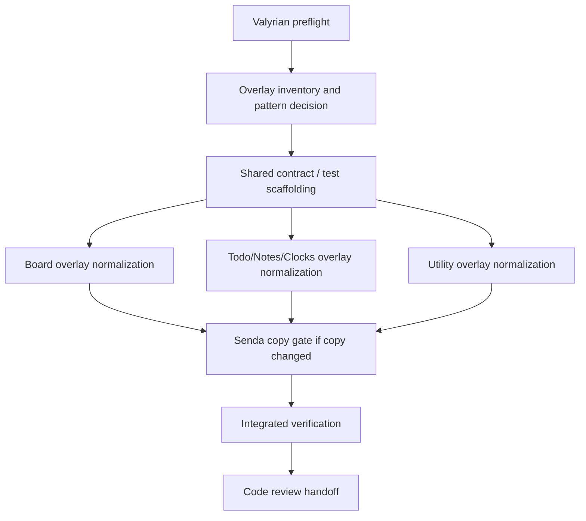

# UI Overlay Action/Layout Consistency Implementation Plan

> **For agentic workers:** REQUIRED SUB-SKILL: use `subagent-driven-development` or `executing-plans` to implement this plan task-by-task. Implementation owner should be `mini-kapa8`; copy review gate should be `senda` if any visible UI copy changes.

**Goal:** Verify and align productive overlays so action rows share one visual/structural pattern, `bottomNav` stays pinned to the overlay bottom, and edit surfaces use the available overlay space without overdraw.

**Architecture:** Keep the pass inside `ui/` plus UI regression tests. Treat `AppOverlay` slots as the shared contract, avoid new app architecture, and make only the smallest page-level layout changes needed to normalize overlay behavior.

**Tech Stack:** CommonJS CLI with `ui/app.tsx` loaded through `tsx/cjs`, Valyrian terminal primitives from `@valyrianjs/terminal`, Node's built-in test runner.

---

## Alcance

- Review all productive overlays in Board, Todo, Notes, Clocks, and Utilities.
- Normalize overlay action rows so primary/secondary/destructive/close actions follow the same structural pattern.
- Ensure every overlay footer/action row rendered through `bottomNav` is visually pinned to the last internal overlay row.
- Ensure edit/create surfaces, especially Board `Edit card`, use available vertical space for editor/input content while preserving fixed footer actions.
- Add or update focused UI regressions for `80x24`, bottom-pinned action rows, and edit-surface fill behavior.

## No-alcance

- Do not revive `ui/app.js`.
- Do not convert the repo to TypeScript-only, ESM, or Bun.
- Do not change the CommonJS CLI or root command behavior.
- Do not move root `ilu` behavior to the TUI.
- Do not reintroduce `Tools`, `Current list`, `Switch to board`, or `Selected board: ...` visible copy.
- Do not change Board column-width policy or implement content-aware widths.
- Do not add manual sync runtime calls from UI mutators.
- Do not implement unrelated accessibility, keyboard, sync, model, or Inquirer changes.
- Do not perform VCS-mutating commands.

## Repo findings used for this plan

- `package.json` uses `node --test` as the root test runner and includes `@valyrianjs/terminal`, `valyrian.js`, and `tsx`.
- `ui/components/Overlay.tsx` defines `AppOverlay` slots: `title`, `topNav`, `content`, and `bottomNav`; `bottomNav` is rendered in a fixed bottom region.
- Productive overlay consumers live mainly in:
  - `ui/pages/board/MainView.tsx`
  - `ui/pages/todos/MainView.tsx`
  - `ui/pages/notes/MainView.tsx`
  - `ui/pages/clocks/MainView.tsx`
  - `ui/components/UtilityHost.tsx`
  - `ui/app.tsx` for app-level/help overlays if touched by the audit.
- Existing regression coverage already checks `AppOverlay` slot usage, full-surface overlay boundaries, Todo/Note details bottom action rows, Board action bar placement, and 80-column overdraw constraints in `tests/ui-shared-foundation.test.js` and `tests/ui-app.test.js`.
- Board has the densest overlay set and likely owns the highest-risk edit layout: add/edit card, card details/actions, move/priority, board management and column action surfaces, and confirm overlays.

## Overlays / pantallas a revisar

### Shared / app shell

- App/help overlays in `ui/app.tsx`, only if they use `AppOverlay` and participate in the same action/footer pattern.
- Shared `AppOverlay` behavior in `ui/components/Overlay.tsx`; modify only if the audit proves page-level fixes are insufficient.

### Board

- Card overlays: add card, card details, edit card, move card, priority card, remove card confirm, card action error.
- Board overlays: boards menu, add board, rename board, remove board confirm.
- Column overlays: column details/actions, add column, rename column, set WIP limit, reset columns confirm, remove column confirm.
- Specific focus: `Edit card` must allocate available height to its description editor/content area and keep Save/Cancel pinned through the same action-row pattern used by details.

### Todo

- List manager, add/edit task form, add/rename list form, task details, remove task confirm, remove list confirm.
- Specific focus: task form editor and task details actions should not float above unused space.

### Notes

- List manager, add/edit note form, add/rename list form, note details, remove note confirm, remove list confirm.
- Specific focus: note form editor and note details actions should follow the same layout contract as Todo.

### Clocks

- Add clock and remove clock confirm overlays.
- Specific focus: keep action rows consistent even when content is short.

### Utilities

- Sync setup overlay.
- Translate main/result surface if represented as an overlay or overlay-like surface.
- Speech voice chooser overlay and any secondary utility overlay.
- Specific focus: long result/list content must not push actions/footer off the bottom.

## Dependency tree

| Task | Type | Owner | Touched areas | Depends on | Blocks | Can parallel with | Conflicts with | global_test_safe_parallel | Validation scope | Risk |
| --- | --- | --- | --- | --- | --- | --- | --- | --- | --- | --- |
| T0 Valyrian preflight | blocker | mini-kapa8 | `node_modules/@valyrianjs/terminal/llms-full.txt`, `node_modules/@valyrianjs/terminal/src` if needed | none | T1-T5 | none | none | yes | Implementation summary states docs/source consulted before terminal primitive changes | low |
| T1 Overlay inventory and pattern decision | blocker | mini-kapa8 | `ui/**/*.tsx`, existing UI tests | T0 | T2-T5 | none | all overlay tasks | no | Inventory list with current action-row/footer/edit-fill gaps | medium |
| T2 Shared contract / test scaffolding | dependent | mini-kapa8 | `ui/components/Overlay.tsx` if needed, `tests/ui-shared-foundation.test.js` | T1 | T3-T5 | none | shared overlay helpers/tests | no | Red regressions for bottom-pinned actions and edit-fill contract | medium |
| T3 Board overlay normalization | dependent | mini-kapa8 | `ui/pages/board/MainView.tsx`, `tests/ui-app.test.js` or shared UI tests | T2 | T6 | T4, T5 only after shared contract is fixed | shared helpers if changed simultaneously | no | Board overlays at 80x24, especially Edit card and card details/actions | high |
| T4 Todo/Notes/Clocks overlay normalization | dependent | mini-kapa8 | `ui/pages/todos/MainView.tsx`, `ui/pages/notes/MainView.tsx`, `ui/pages/clocks/MainView.tsx`, `tests/ui-todo-notes-ui.test.js`, `tests/ui-clocks-ui.test.js` | T2 | T6 | T3, T5 only after shared contract is fixed | shared helpers if changed simultaneously | no | Details/forms/confirms pin actions and keep editors useful at 80x24 | medium |
| T5 Utility overlay normalization | dependent | mini-kapa8 | `ui/components/UtilityHost.tsx`, `tests/ui-sync-ui.test.js`, `tests/ui-babel-tts-ui.test.js` | T2 | T6 | T3, T4 only after shared contract is fixed | shared helpers if changed simultaneously | no | Sync/Translate/Speech overlays keep scrollable content separate from footer/actions | medium |
| T6 Senda copy gate | external-gate | senda | Changed visible UI strings only | T3-T5 if copy changes | V1 | none | visible copy changes | yes | Copy approval or explicit note that no visible copy changed | low |
| V1 Integrated verification | verification | mini-kapa8 | Focused UI suites and optional root runner | T3-T6 | R1 | none | all changed code | no | Test evidence for affected UI scenarios; root `node --test` if broad enough | medium |
| R1 Code review handoff | verification | code-reviewer | Final diff and evidence | V1 | done | none | none | yes | Review findings; no test ownership | low |

## Dependency DAG

## Execution waves / barriers

### Wave 0 — Preflight

- `mini-kapa8` reads `node_modules/@valyrianjs/terminal/llms-full.txt` before changing Valyrian terminal code.
- If `Fixed`, `Pane`, `ScrollView`, `Editor`, `Overlay`, or slot sizing behavior is unclear, consult `node_modules/@valyrianjs/terminal/src` as source of truth.

**Barrier B0:** No code changes touching Valyrian primitives or overlay layout until preflight is complete.

### Wave 1 — Inventory and contract

- Build a short inventory of every productive `AppOverlay` consumer and classify each as details/result, edit/create form, menu/list, or confirmation/error.
- Decide the single acceptable action pattern for this pass: content area owns scroll/edit fill; actions live in `bottomNav` where the overlay has footer actions; short confirm overlays may remain compact only if they do not create a competing pattern for edit/details actions.
- Add failing/regression checks for representative gaps before implementation.

**Barrier B1:** Do not normalize individual screens until the action/footer/edit-fill contract is explicit; otherwise Board/Todo/Utility work may diverge.

### Wave 2 — Productive overlay normalization

- Board first, because it has the highest overlay density and `Edit card` is the named high-risk surface.
- Then normalize Todo, Notes, and Clocks using the same contract.
- Then normalize Utility overlays/results, keeping scrollable content separate from fixed actions/footer.
- Keep visible UI copy in English, direct for users, and free of internal implementation/spec terms.

**Barrier B2:** If visible strings change, collect the exact changed strings and send them to `senda` before final verification.

### Wave 3 — Verification and review

- Run focused UI tests for changed areas after all implementation changes are integrated.
- Run root `node --test` only if the changes touched shared overlay primitives or app-shell behavior broadly enough to justify the full runner.
- Hand final diff and evidence to `code-reviewer`; do not ask `code-reviewer` to own test execution.

**Barrier B3:** Global verification waits until all page/utility overlay changes and the copy gate are complete.

## Archivos probables

- `ui/components/Overlay.tsx`
  - Only if the shared `AppOverlay` contract needs a small adjustment to consistently reserve bottom space or expose an existing layout option.
- `ui/pages/board/MainView.tsx`
  - Primary target for edit/details/action-row consistency and 80x24 Board overlay regressions.
- `ui/pages/todos/MainView.tsx`
  - Task/list form and details action-row consistency.
- `ui/pages/notes/MainView.tsx`
  - Note/list form and details action-row consistency.
- `ui/pages/clocks/MainView.tsx`
  - Short add/remove overlays and confirmation action consistency.
- `ui/components/UtilityHost.tsx`
  - Sync setup, Translate result, and Speech voice/result surfaces.
- `tests/ui-shared-foundation.test.js`
  - Shared overlay contract, bottom row, full-surface, and no-overdraw assertions.
- `tests/ui-app.test.js`
  - Board-specific overlay behavior and app-level 80x24 assertions.
- `tests/ui-todo-notes-ui.test.js`
  - Todo/Notes form/details overlay regressions.
- `tests/ui-clocks-ui.test.js`
  - Clocks overlay regressions.
- `tests/ui-sync-ui.test.js`, `tests/ui-babel-tts-ui.test.js`
  - Utility overlay/result regressions if Utilities change.

## TDD / validation plan

### Red checks to add first

- Representative overlays render their footer/action row on the last internal overlay row at `80x24`.
- Board `Edit card` keeps Save/Cancel at the bottom and gives the description editor/content area the remaining usable vertical space.
- Todo and Notes edit/create overlays do not leave a large unused block below the editor while actions float above the bottom.
- Details/result overlays keep scrollable content above `bottomNav`; long content does not displace actions.
- All affected screens render no more than 24 rows and no line longer than 80 columns.
- Productive overlay consumers continue using `AppOverlay` slots rather than direct terminal `Overlay` or child content.

### Focused evidence expected from implementation

- Shared overlay contract evidence covering bottom-pinned action rows, full-surface boundaries, slot usage, and no-overdraw behavior.
- Board-focused evidence covering affected Board overlays, especially `Edit card`, card details/actions, and 80x24 rendering.
- Todo/Notes-focused evidence when Todo or Notes screens change, covering edit/create forms, details views, and action/footer placement.
- Clocks-focused evidence when Clocks screens change, covering short add/remove overlays and confirmation action consistency.
- Utilities-focused evidence when Utility surfaces change, covering Sync, Translate, Speech, long content separation from footer/actions, and no-overdraw behavior.
- Integrated root-runner evidence after all changes are merged only if shared overlay primitives or broad app-shell behavior changed enough to justify whole-repo validation.

## Gate de `senda` para copy visible

Use `senda` only if implementation changes visible strings, labels, headings, placeholders, help text, errors, or button text.

Checklist:

- UI visible remains in English.
- Copy is direct for the end user, not a description of implementation or acceptance criteria.
- Do not expose routes, file names, internal ids, agent names, taxonomy, contracts, or plan language.
- Do not reintroduce `Tools`, `Current list`, `Switch to board`, or `Selected board: ...`.
- Actions use a consistent vocabulary across products: edit/save/cancel/close/remove/delete only where semantically appropriate.
- Destructive confirmations remain explicit and safe.

If no visible copy changes, implementation summary should say `senda gate not required: no visible copy changed`.

## Resultado observable esperado

- At `80x24`, all affected overlays stay inside the frame with no overdraw.
- Overlay footer/action rows are visually pinned to the last internal overlay row when the overlay exposes actions.
- Board `Edit card` no longer feels vertically compressed or floating; the edit surface uses the available overlay space while Save/Cancel remain fixed at the bottom.
- Todo/Notes edit and details overlays follow the same action/footer layout rhythm as Board.
- Clocks and Utilities do not introduce special-case action placement that conflicts with the shared pattern.
- Tests document the layout contract so future overlay additions fail when actions float or content pushes the footer away.

## Riesgos

- **Shared primitive risk:** A broad change in `AppOverlay` could alter every overlay. Mitigation: prefer page-level fixes unless the shared contract is clearly wrong, and run shared + affected UI tests after integration.
- **Valyrian layout semantics:** `Fixed`, `Pane fill`, `ScrollView`, or `Editor` height behavior may not match intuition. Mitigation: read `llms-full.txt` first and consult `src` only where needed.
- **Board regression risk:** Board overlays share state, selection, focus, and action handlers. Mitigation: implement Board as a single semantic unit and verify focused Board scenarios before other pages inherit the pattern.
- **Overdraw risk:** Increasing editor heights can break `80x24`. Mitigation: calculate against overlay inner height and prove with rendered-line tests.
- **Copy drift risk:** Normalizing action labels may accidentally undo approved copy. Mitigation: only change copy when required for consistency and run `senda` gate for any visible text change.
- **Parallelism risk:** Page files can look independent but may depend on the shared overlay contract and tests. Mitigation: only parallelize Wave 2 after T2 is complete and avoid concurrent edits to shared helper/tests.
