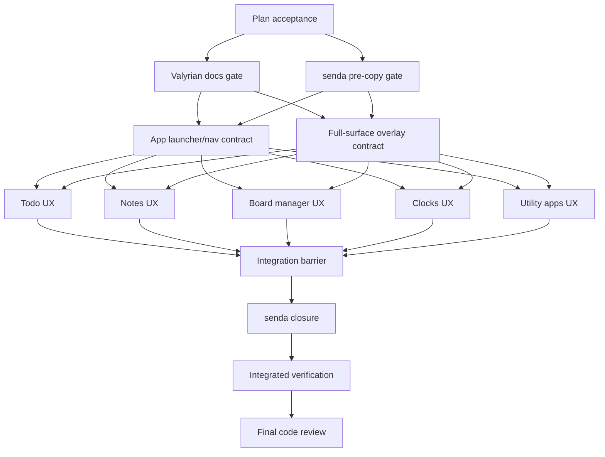

# UI UX Corrections After Parity Plan

> Planning-only document. Do not implement product code from this file until the plan is accepted. Implementation must be delegated to `mini-kapa8` or the correct specialist; `stack-planner` owns sequencing, acceptance, integration barriers, and final validation strategy.

**Goal:** Correct `ilu ui` so it behaves as a productivity app launcher with first-class Todo, Notes, Board, Clocks, Sync, Translate, and Speech apps, while preserving the TSX-only UI migration boundary.

**Architecture:** Keep `ui/app.tsx` as shell/delegation, move domain behavior into page/component modules, and use Valyrian terminal primitives for semantic selection, virtualized lists, overlays, and visible clickable actions. The work is dependency-first: shell/nav and overlay contracts land before parallel page-level UX corrections.

**Tech stack:** Node.js CommonJS CLI, `tsx/cjs`, `ui/app.tsx`, TSX under `ui/`, `@valyrianjs/terminal`, `valyrian.js`, existing CommonJS models/actions for todos, notes, board, clocks, sync, translate, and TTS.

---

## Critical correction to prior planning

This plan explicitly corrects the previous wrong assumption that top nav should contain only `Todo`, `Notes`, `Board`, and `Clocks`. For this work, `Sync`, `Translate`, and `Text to Speech` are apps/tools at the same launcher level as the existing four apps.

The accepted top nav direction is:

- `Todo Notes Board Clocks Sync Translate Speech`
- `Speech` is the short nav label.
- The Speech app screen may use `Text to Speech` as its internal heading.
- The old `Tools` launcher and `Choose a tool.` overlay are removed.

## Alcance

- Rework top-nav/app launcher behavior to include `Sync`, `Translate`, and `Speech` as first-class nav items.
- Rework Todo and Notes views so item lists and list management are separated: selector at the top, item list as the primary view, details overlays with actions inside, and list manager in an overlay.
- Rework Todo interactions so `Enter`/`Space` toggles done/open for the selected task and double click opens task details.
- Rework Notes interactions so double click opens note details and `Enter` opens details.
- Rework Board manager so board switching happens only through the top board selector; manager uses a virtualized list and has `Add`, `Rename`, `Delete`, and `Close` at the same action level.
- Rework Clocks so the clock list is virtualized and `Add clock`, `Move up`, `Move down`, and `Remove` are visible direct action-bar actions acting on the selected clock.
- Remove redundant upper page titles in Todo, Notes, and Clocks.
- Make bordered overlay surfaces fill the full available overlay surface in every overlay.
- Update UI/headless tests and visible-copy assertions to match the new UX direction.
- Include `senda` gates for visible copy before and after implementation.

## No-alcance

- No product/code implementation in this planning step.
- No product tests executed in this planning step.
- No commits and no VCS operations that modify state.
- No `ui/app.js` revival.
- No repo-wide TypeScript, ESM, or Bun migration.
- No root `ilu` default-to-TUI change.
- No Inquirer removal.
- No content-aware Board column width work.
- No manual sync runtime calls from TUI mutators; existing model mutator sync hooks remain the runtime path.
- No visible UI copy that exposes internal implementation contracts, file paths, IDs, task names, agents, acceptance criteria, or planning language.

## Repo-first findings

- `package.json` exposes the CommonJS `ilu` binary from `./bin/cli.js`, uses the Node test runner at the repo root, and includes `@valyrianjs/terminal`, `valyrian.js`, `tsx`, and TypeScript dependencies (`package.json:8-32`).
- `ui/app.tsx` currently types app tabs as only `Todo | Notes | Board | Clocks` and freezes `TABS` to those four labels (`ui/app.tsx:21`, `ui/app.tsx:146`).
- The app shell currently renders `createTopNav(state, TABS, ...)`, so top nav expansion is a shell-level contract change (`ui/app.tsx:415-424`).
- Utility workflows currently sit behind a `Tools` button (`ui/components/UtilityHost.tsx:141-147`) and a `Tools` / `Choose a tool.` overlay (`ui/components/UtilityHost.tsx:392-414`).
- Existing utility UI tests currently encode the now-obsolete assumption that Sync, Translate, and Text to Speech stay off top nav (`tests/ui-sync-ui.test.js:54-70`, `tests/ui-babel-tts-ui.test.js:39-53`).
- Todo and Notes currently mix item lists and list manager controls in the same main view and show `Current list: ...` (`ui/pages/todos/MainView.tsx:371-397`, `ui/pages/notes/MainView.tsx:351-377`).
- Todo and Notes currently expose selected-item actions in the main view regardless of detail context (`ui/pages/todos/MainView.tsx:532-538`, `ui/pages/notes/MainView.tsx:516-521`).
- Todo and Notes item lists are already Valyrian `List` primitives with `virtualized={true}`, but current `onpress` opens details rather than applying the requested key/press behavior split (`ui/pages/todos/MainView.tsx:351-367`, `ui/pages/notes/MainView.tsx:331-347`).
- Board already has a top board selector (`ui/pages/board/MainView.tsx:120-149`) and Board card lists already use semantic double press for details (`ui/pages/board/BoardColumn.tsx:188-205`).
- Board manager currently still includes `Switch to board` in the manager overlay (`ui/pages/board/MainView.tsx:1222-1266`).
- Clocks main list is already virtualized (`ui/pages/clocks/MainView.tsx:389-404`), but `Remove clock` and `Reorder clocks` are currently secondary body actions rather than action-bar peers of `Add clock` (`ui/pages/clocks/MainView.tsx:551-563`).
- Overlays commonly use a 10% margin and wrap `Pane fill={true}` inside that reduced overlay area, so the bordered surface does not occupy the full overlay surface (`ui/pages/todos/MainView.tsx:400-432`, `ui/pages/notes/MainView.tsx:380-414`, `ui/pages/clocks/MainView.tsx:415-466`, `ui/components/Overlay.tsx:6-10`).

## Estado observado del feedback

| # | Feedback | Observed state | Plan response |
| --- | --- | --- | --- |
| 1 | Todo mixes tasks and todo lists in one view | Confirmed in Todo main nodes and `listRows` | Move list management into overlay; keep selected-list selector above tasks |
| 2 | `Current list` is noise | Confirmed in Todo and Notes list sections | Remove `Current list` copy |
| 3 | Todo needs list selector like Board board selector | Todo currently uses list manager list, not selector | Add top selector row for lists; manager becomes overlay |
| 4 | Hide task actions when no task selected; actions belong in detail | Current main view always renders task action row | Move details/edit/toggle/remove into task detail overlay |
| 5 | Task details via double click, actions inside detail | Current Todo `onpress` opens details | Add semantic double press for details; keep actions inside details |
| 6 | Tasks with virtualized `List`; Enter/Space toggles done | Virtualized list exists; key behavior not aligned | Keep virtualized list; wire `Enter`/`Space` fallback to selected task toggle |
| 7 | Button to manage todo lists in overlay | Current manager is inline | Add `Manage lists` action opening overlay |
| 8 | Sync, Translate, Speech in top nav | Current tools behind `Tools` overlay and tests assert off-nav | Promote to top nav apps; remove `Tools` overlay |
| 9 | Notes applies almost same as Todo | Current Notes mirrors current Todo problems | Apply same selector/list/details/manager split with Notes-specific key behavior |
| 10 | Board manager: remove `Switch to board` | Confirmed present | Remove switch action from manager; top selector is switching path |
| 11 | Board manager: virtualized List; Rename/Delete at Add level | Current manager maps rows with per-row buttons | Use selected board list plus action row `Add`, `Rename`, `Delete`, `Close` |
| 12 | Clocks: List virtualized and Remove/Reorder at Add level | Main list virtualized; actions split into body and reorder overlay | Action bar becomes `Add clock`, `Move up`, `Move down`, `Remove`; actions operate selected clock |
| 13 | Remove redundant upper titles in Todo, Notes, Clocks | Current views render `Todo`, `Notes`, `Clocks` text above content | Remove page titles; top nav already provides context |
| 14 | Overlay bordered surface fills overlay | Current margin/pane pattern leaves inset bordered surface | Establish shared full-surface overlay contract and apply across overlays |

## Decisiones de UX incorporadas

- `ilu ui` is a launcher of productivity apps, not four tabs plus a hidden tools menu.
- Top nav labels are exactly `Todo`, `Notes`, `Board`, `Clocks`, `Sync`, `Translate`, `Speech` unless `senda` blocks a copy issue.
- `Speech` is nav copy only; inside the app, `Text to Speech` remains acceptable user-facing copy.
- Todo and Notes list selectors are lightweight top controls, not full management panels.
- Todo and Notes list management lives in overlays opened by visible buttons.
- Todo task details and Note details are modal/detail surfaces; mutating item actions live there.
- Todo selected-row keyboard behavior prioritizes fast completion: `Enter` and `Space` toggle done/open. Details are opened with double click and a visible `Details` action where needed.
- Notes selected-row keyboard behavior prioritizes reading: double click opens details; `Enter` should open details.
- Board switching remains available through the existing top board selector. Board manager becomes management-only.
- Clocks direct operations target the selected clock; no separate reorder mode is needed for normal move up/down.
- All actions remain visible/clickable; keyboard mappings are fallbacks, not the only path.
- UI visible copy stays in English and must not expose internal specs, routes, IDs, task names, agent names, implementation taxonomies, or file paths.

## Archivos/áreas probables

### Shell and app launcher

- `ui/app.tsx`
- `ui/types.ts`
- `ui/components/TopNav.tsx`
- `ui/components/AppShell.tsx`
- `ui/components/UtilityHost.tsx`

### Shared overlay/action components

- `ui/components/Overlay.tsx`
- `ui/components/ActionBar.tsx`
- `ui/components/Button.tsx`
- `ui/theme.ts`

### Domain pages

- `ui/pages/todos/MainView.tsx`
- `ui/pages/notes/MainView.tsx`
- `ui/pages/board/MainView.tsx`
- `ui/pages/board/BoardColumn.tsx` only if board manager selection/helper reuse needs it
- `ui/pages/board/BoardActionBar.tsx`
- `ui/pages/clocks/MainView.tsx`

### Existing adapters and read model, only if contracts require it

- `ui/todo-actions.js`
- `ui/note-actions.js`
- `ui/board-actions.js`
- `ui/clock-actions.js`
- `ui/sync-actions.js`
- `ui/babel-actions.js`
- `ui/tts-actions.js`
- `ui/read-model.js`

### Tests likely to change or gain coverage

- `tests/ui-app.test.js`
- `tests/ui-todo-notes-ui.test.js`
- `tests/ui-clocks-ui.test.js`
- `tests/ui-sync-ui.test.js`
- `tests/ui-babel-tts-ui.test.js`
- `tests/ui-read-model.test.js` only if snapshot contracts change
- `ui/app-shell-contract.test.ts`

## Dependency tree

| Task | Type | Owner | Touched areas | Depends on | Blocks | Can parallel with | Conflicts with | global_test_safe_parallel | Validation scope | Risk |
| --- | --- | --- | --- | --- | --- | --- | --- | --- | --- | --- |
| P-00 Plan acceptance | external-gate | stack-planner + user | `docs/plans/2026-06-06-ui-ux-corrections-after-parity.md` | none | all implementation | none | n/a | yes | plan review only | medium |
| P-01 Valyrian docs gate | external-gate | mini-kapa8 | `node_modules/@valyrianjs/terminal/llms-full.txt`, `node_modules/@valyrianjs/terminal/src` | P-00 | shell, overlay, list, double-press/key work | none | n/a | yes | read/confirm Valyrian contracts before code edits | high |
| P-02 `senda` pre-copy gate | external-gate | senda | planned visible copy for nav, actions, overlays, empty states | P-00 | all UI copy implementation | P-01 | n/a | yes | copy approval report | medium |
| F-01 App launcher/nav contract | blocker | mini-kapa8 | `ui/app.tsx`, `ui/types.ts`, `ui/components/TopNav.tsx`, `ui/components/UtilityHost.tsx`, utility tests | P-01, P-02 | U-01, T-01, N-01, B-01, C-01, V-01 | F-02 if ownership excludes UtilityHost overlays | UtilityHost, app active-tab state, obsolete tests | no | nav/headless app tests | high |
| F-02 Full-surface overlay contract | blocker | mini-kapa8 foundation instance | `ui/components/Overlay.tsx`, `ui/theme.ts`, shared overlay usage contract and focused shared overlay tests only | P-01, P-02 | T-01, N-01, B-01, C-01, U-01 | F-01 if no shared files | page modules; F-02 must not apply page-specific overlays directly | no | overlay smoke/headless output width and surface checks | high |
| T-01 Todo UX correction | dependent | mini-kapa8 Todo instance | `ui/pages/todos/MainView.tsx`, Todo UI tests | F-01, F-02 | I-01, V-01 | N-01, B-01, C-01, U-01 | shared helpers if introduced; avoid unless justified | no | Todo headless UI tests | high |
| N-01 Notes UX correction | dependent | mini-kapa8 Notes instance | `ui/pages/notes/MainView.tsx`, Notes UI tests | F-01, F-02 | I-01, V-01 | T-01, B-01, C-01, U-01 | shared helpers if introduced; avoid unless justified | no | Notes headless UI tests | high |
| B-01 Board manager correction | dependent | mini-kapa8 Board instance | `ui/pages/board/MainView.tsx`, maybe `BoardActionBar.tsx`, Board UI tests | F-01, F-02 | I-01, V-01 | T-01, N-01, C-01, U-01 | Board selector/manager state | no | Board manager/headless UI tests | medium |
| C-01 Clocks UX correction | dependent | mini-kapa8 Clocks instance | `ui/pages/clocks/MainView.tsx`, Clocks UI tests | F-01, F-02 | I-01, V-01 | T-01, N-01, B-01, U-01 | action bar/shared overlay contract | no | Clocks headless UI tests | medium |
| U-01 Utility apps correction | dependent | mini-kapa8 Utility instance | `ui/components/UtilityHost.tsx`, possible utility page modules, `ui/app.tsx`, Sync/Translate/TTS UI tests | F-01, F-02 | I-01, V-01 | T-01, N-01, B-01, C-01 after F-01 settled | app tab contract, UtilityHost state | no | Sync/Translate/Speech headless UI tests | high |
| I-01 Integration barrier | integration | stack-planner + mini-kapa8 | all changed UI areas and tests | T-01, N-01, B-01, C-01, U-01 | S-01, V-01 | none | all UI areas | no | conflict resolution and updated dependency table | high |
| S-01 `senda` closure gate | external-gate | senda | rendered visible copy from integrated UI | I-01 | V-01 | none | n/a | yes | copy closure report | medium |
| V-01 Integrated verification | verification | mini-kapa8 verifier instance | UI test suites and selected broader repo-runner scope | I-01, S-01 | R-01 | none | all global tests | no | relevant UI suites, then broader regression scope if needed | high |
| R-01 Final review handoff | verification | code-reviewer | final diff + test evidence | V-01 | completion | none | n/a | yes | review evidence, not test execution | medium |

## Execution waves

### Wave 0 — Planning and gates

- Confirm this plan is accepted.
- Before implementation, `mini-kapa8` must read `node_modules/@valyrianjs/terminal/llms-full.txt` and consult `node_modules/@valyrianjs/terminal/src` for any uncertain List, Overlay, key binding, double-press, focus, or layout behavior.
- `senda` reviews planned visible copy for final-user clarity and internal-language leakage.

### Wave 1 — Shared foundations

- Implement `F-01` app launcher/nav contract.
- Implement `F-02` full-surface overlay contract as a shared foundation only; page/app-specific overlay adoption happens inside `T-01`, `N-01`, `B-01`, `C-01`, and `U-01`.
- Barrier after Wave 1:
  - Top nav renders the seven accepted labels at 80 columns without overdraw.
  - `Tools` and `Choose a tool.` are gone from launcher flows.
  - Overlay contract is clear enough that page teams do not invent conflicting overlay margins/surfaces, and F-02 has not edited page modules directly.
  - Tests that encoded the obsolete off-nav utility assumption are rewritten before page work relies on them.

### Wave 2 — Parallel page/app corrections

After Wave 1 is integrated, Wave 2 means multiple isolated `mini-kapa8` subagent instances by workstream, not one serial `mini-kapa8` pass. Run the following in parallel only if each instance stays within the listed touched areas and does not introduce shared helpers without coordination:

- `T-01` Todo UX correction.
- `N-01` Notes UX correction.
- `B-01` Board manager correction.
- `C-01` Clocks UX correction.
- `U-01` Utility apps correction.

Wave 2 handoff contract per subagent instance:

- Each instance receives the full accepted plan, the implementation constraints, the critical correction that Sync/Translate/Speech are first-class nav apps, the accepted visible-copy inventory, the complete Wave 1 output, and the exact file boundaries from the dependency table.
- Each instance reports changed files, focused verification scope selected for its area, visible-copy changes, any dependency-table changes, and any conflicts with shared shell/overlay contracts.
- If an instance needs to edit outside its touched areas, introduce shared helpers, or change a shared contract, it must stop and route that through the integration barrier instead of making an uncoordinated cross-workstream edit.

Wave 2 local verification may run focused suites for the owned area only. Global root-runner or broad integrated UI verification waits for the integration barrier.

### Wave 3 — Integration barrier

- Collect all subagent outputs and changed files.
- Resolve conflicts in `ui/app.tsx`, `ui/types.ts`, `UtilityHost`, shared overlay contracts, and tests.
- Confirm no page reintroduced inline Tools launcher copy, redundant top page titles, or internal-language visible copy.
- Confirm Todo/Notes did not create unnecessary shared abstractions for only two usages unless there is a concrete contract benefit.
- Confirm 80x24 output has no lines over 80 columns in affected headless tests.
- Update this dependency table if implementation discoveries change dependencies or ownership.

### Wave 4 — Copy closure and verification

- `senda` reviews integrated rendered output for nav, actions, empty states, details, confirmations, errors, and overlays.
- `mini-kapa8` runs integrated UI verification. Expected initial scope:
  - focused UI app tests;
  - Todo/Notes UI suite;
  - Clocks UI suite;
  - Sync/Translate/Speech utility UI suites;
  - app-shell contract scope if the current repo state supports it;
  - broader root-runner regression scope only after focused UI scopes pass or if shared contracts changed beyond UI scope.
  - `mini-kapa8` determines exact commands from the current repo state and documents them in the evidence.
- `code-reviewer` reviews final diff and evidence; it does not own test execution.

## Barreras de integración

- **Después de Wave 1:** no iniciar workstreams de Todo, Notes, Board, Clocks o Utility apps hasta que el contrato de top nav y el contrato de overlay full-surface estén integrados y los tests obsoletos de utilities off-nav estén actualizados.
- **Durante Wave 2:** subagentes pueden correr suites enfocadas de su área, pero no deben correr verificación global mientras haya cambios paralelos activos.
- **Antes de Wave 4:** recopilar salidas de subagentes, resolver conflictos, revisar copy visible, confirmar 80x24 sin overdraw y actualizar el dependency tree si cambió la realidad de dependencias.
- **Antes de code review:** `mini-kapa8` debe entregar evidencia fresca de verificación integrada; `code-reviewer` revisa diff y evidencia, no repite suites por ritual.

## Implementation constraints for subagents

- Keep KISS; do not re-architect root CLI, models, sync runtime, or whole-repo module format.
- Keep `ui/app.tsx` as shell/delegation. If it grows domain logic, move that logic into focused UI page/component modules.
- Prefer local duplication over premature helpers for only Todo + Notes unless a shared contract demonstrably reduces bugs.
- Do not create one-line helpers unless logic repeats in at least three places or an existing external contract requires it.
- Prefer clear `for` / `for...of` loops over `forEach` when control flow, early exit, or cost matters.
- Move invariant calculations, regexes, closures, normalizations, and lookups out of hot loops or virtualized render paths when safe.
- Do not use coordinate math or `clickAt` as the primary selection mechanism; use stable ids, list events, selected item identity, and semantic Valyrian events.
- Keep actions visible/clickable and keymaps as fallback.
- Maintain 80x24 without overdraw.

## Per-area task intent

### F-01 App launcher/nav contract

- Extend app/tab state to include `Sync`, `Translate`, and `Speech` as first-class active apps.
- Ensure `createTopNav` renders the accepted labels and selection state.
- Replace utility access through `Tools` with direct top-nav selection.
- Decide whether utility app content remains hosted by `UtilityHost` or is split into focused utility page modules; prefer the smallest split that keeps `ui/app.tsx` shell-only.
- Update `Ctrl+1` through `Ctrl+7` or another documented fallback mapping if keymaps are retained for all nav apps.
- Update obsolete tests that assert utilities are off-nav.

### F-02 Full-surface overlay contract

- Define one overlay/surface pattern that makes the bordered surface fill the overlay area.
- Limit F-02 edits to shared overlay/theme contract files and focused shared overlay tests; do not edit Todo, Notes, Board, Clocks, Sync, Translate, or Speech page modules in F-02.
- Hand off the adopted pattern to T-01, N-01, B-01, C-01, and U-01 so those page/app tasks apply it consistently to their confirmations, forms, details, list managers, and voice/time-zone pickers within their own file boundaries.
- Avoid a broad visual redesign; this is a layout contract correction only.

### T-01 Todo UX correction

- Remove redundant top `Todo` title from the page body.
- Add a top selected-list selector like Board’s board selector, using stable ids and semantic list identity.
- Remove inline `Current list` copy.
- Move todo-list add/rename/delete/use management into a `Manage lists` overlay.
- Keep task rows as a virtualized `List`.
- Change selection behavior so single selection updates selected task, double click opens task details, and `Enter`/`Space` toggles done/open for the selected task.
- Move `Edit task`, done/open toggle, and `Remove task` into the task details overlay.
- Do not show selected-task actions when no task is selected.

### N-01 Notes UX correction

- Remove redundant top `Notes` title from the page body.
- Add top selected-list selector like Board’s board selector.
- Remove inline `Current list` copy.
- Move note-list add/rename/delete/use management into a `Manage lists` overlay.
- Keep note rows as a virtualized `List`.
- Use double click and `Enter` to open note details.
- Move `Edit note` and `Remove note` into the note details overlay.
- Do not show selected-note actions when no note is selected.

### B-01 Board manager correction

- Preserve existing top board selector as the only switching surface.
- Remove `Switch to board` from Board manager.
- Replace per-row management buttons with a virtualized board list and selected-board actions at the same level as `Add`.
- Manager action row should expose `Add`, `Rename`, `Delete`, and `Close`.
- Keep current Board card double-click details behavior and column-width policy unchanged.

### C-01 Clocks UX correction

- Remove redundant top `Clocks` title from the page body.
- Keep the main clocks list virtualized.
- Promote `Move up`, `Move down`, and `Remove` to the action bar next to `Add clock`.
- Actions operate on the selected clock.
- Replace the reorder overlay with direct selected-clock movement unless implementation discovers a Valyrian constraint that requires a modal fallback.
- Keep add-clock and remove confirmation flows visible/clickable and full-surface.

### U-01 Utility apps correction

- Remove `Tools` launcher and `Choose a tool.` copy.
- Make `Sync`, `Translate`, and `Speech` render as active top-nav apps/tools.
- Keep Sync status/action behavior but render from the Sync app surface, with setup/init as an overlay if needed.
- Keep Translate form/result/dictionary behavior but render from the Translate app surface.
- Keep TTS behavior but render from the Speech app surface; use `Text to Speech` as internal heading.
- Preserve secret-safe behavior: no API-key input field and no secrets in visible output.
- Do not add manual sync runtime calls from mutators.

## Copy visible previsto

Subject to `senda` review, expected visible English copy includes:

- Top nav: `Todo`, `Notes`, `Board`, `Clocks`, `Sync`, `Translate`, `Speech`.
- Todo primary actions: `Add task`, `Manage lists`.
- Todo details actions: `Edit task`, `Mark done` or `Reopen task`, `Remove task`, `Close`.
- Todo list manager actions: `Add list`, `Rename list`, `Delete list`, `Close`.
- Notes primary actions: `Add note`, `Manage lists`.
- Notes details actions: `Edit note`, `Remove note`, `Close`.
- Notes list manager actions: `Add list`, `Rename list`, `Delete list`, `Close`.
- Board manager actions: `Add`, `Rename`, `Delete`, `Close` or domain-specific equivalents `Add board`, `Rename`, `Delete`, `Close` if `senda` prefers clarity.
- Clocks action bar: `Add clock`, `Move up`, `Move down`, `Remove`.
- Utility app headings: `Sync`, `Translate`, `Text to Speech`.

Forbidden visible copy patterns:

- `Tools`
- `Choose a tool.`
- `Current list:`
- `Switch to board`
- `task command`, `adapter`, `snapshot`, `runtime`, `criteria`, `contract`, `agent`, `handoff`, `implementation`, `internal`, file paths, route names, technical IDs, or test/planning language.

## `senda` gates

### Senda pre-implementation gate

`senda` should review the copy inventory above plus the intended app flow and return:

- approved top-nav labels;
- approved action labels;
- any required wording changes for empty states, confirmations, and errors;
- confirmation that visible copy reads for end users, not implementers.

### Senda closure gate

After Wave 2 integration, `senda` should review rendered/headless output from each app:

- top nav;
- Todo empty, list selector, details, and list manager;
- Notes empty, list selector, details, and list manager;
- Board manager;
- Clocks list and actions;
- Sync, Translate, and Speech app surfaces;
- all overlays and confirmation/error states touched by this work.

The closure gate blocks final verification if it finds internal-language leakage or confusing user-facing copy.

## High-level acceptance criteria

- Top nav shows `Todo Notes Board Clocks Sync Translate Speech` and no longer relies on a `Tools` entry.
- `Tools` and `Choose a tool.` are not visible in the normal launcher/tool flow.
- Todo main view no longer mixes list management with the task list; list selection is top-level and list management is overlay-based.
- Todo does not show selected-task actions when there is no selected task.
- Todo task details open by double click and contain task actions.
- Todo `Enter`/`Space` toggles done/open for the selected task.
- Todo tasks remain rendered through virtualized Valyrian `List`.
- Notes mirrors the Todo list-selector/list-manager/details split, with note-appropriate details behavior.
- Notes double click and `Enter` open note details.
- Board manager has no `Switch to board`; switching remains through the top board selector.
- Board manager uses a virtualized list and top-level manager actions for add/rename/delete/close.
- Clocks main list remains virtualized.
- Clocks action bar exposes add/move up/move down/remove, targeting the selected clock.
- Todo, Notes, and Clocks do not render redundant body titles above their content.
- Every overlay’s bordered surface fills its overlay area.
- Affected 80x24 headless output has no overdraw or lines over 80 columns.
- UI visible copy is English and free of internal implementation/spec language.
- No `ui/app.js`, repo-wide TS/ESM/Bun conversion, CLI rewrite, Inquirer removal, or manual sync runtime behavior is introduced.

## Validation plan for implementers

- Start each area with negative tests that encode the requested UX correction before changing product code.
- Focused verification scopes expected during local area work:
  - Todo/Notes UI suite.
  - Clocks UI suite.
  - Sync/Translate/Speech utility UI suites.
  - Shell/nav contract scope.
  - Board manager UI scope, adding or updating the relevant Board UI coverage before running the focused scope selected by the implementer.
  - Implementers determine exact commands from the current repo state and report the commands they actually ran with results.
- Integrated verification waits until the Wave 3 barrier is resolved.
- Do not rerun broad suites just for ritual if fresh complete evidence exists for the same code state and no later changes affected that scope.

## Riesgos

- **Top-nav width at 80 columns:** seven labels can fit, but spacing/focus styles may still overdraw if button padding is too wide.
- **UtilityHost refactor risk:** promoting Sync/Translate/Speech from overlay tools to app surfaces may expose hidden assumptions in `activeOverlay` and tests.
- **Valyrian event semantics:** Todo/Notes key and double-click behavior must be confirmed against `@valyrianjs/terminal` docs/source before edits.
- **Overlay contract blast radius:** changing overlay defaults can affect every modal; use a shared contract and staged adoption.
- **Todo/Notes abstraction temptation:** they are similar, but only two usages are not enough by themselves to justify broad shared helpers.
- **Obsolete tests:** current tests intentionally assert the old utility-off-nav behavior; failing tests are expected until updated.
- **Copy drift:** action labels such as `Delete list` vs `Remove list` need `senda` approval to keep the UI consistent.

## Follow-ups fuera de esta corrección

- Consider a future app-registry abstraction only if more apps/tools are added and current nav/shell code becomes repetitive in at least three places.
- Consider deeper utility module splits only if `UtilityHost` remains too large after promoting utility apps.
- Consider a broader UI information architecture review after this correction if 80x24 constraints make seven nav labels feel crowded.
- Do not address Board content-aware column widths in this work; that remains explicitly out of scope.
