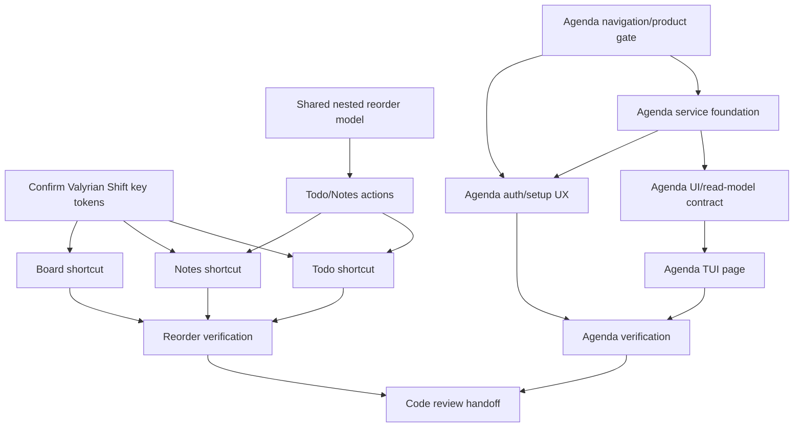

# UI Reorder Shortcuts and Agenda App Implementation Plan

> **For agentic workers:** REQUIRED SUB-SKILL: Use `subagent-driven-development` or `executing-plans` to implement this plan task-by-task. Steps use checkbox (`- [ ]`) syntax for tracking.

**Goal:** Plan two deliverables without implementing them: persistent `Shift+Up`/`Shift+Down` reordering for Board cards, Todo tasks, and Notes; plus a new read-only Google Calendar-backed `Agenda` app with day/week/month views.

**Architecture:** Keep the CLI CommonJS and keep feature logic behind domain/model action adapters instead of mutating UI arrays directly. Reordering must persist through existing models and sync hooks; Agenda should be a new bounded app surface with a service adapter, cache/read model, and compact TUI page rather than a Google Calendar clone.

**Tech stack:** Node.js CommonJS, `tsx/cjs`, `ui/app.tsx`, TSX under `ui/`, `@valyrianjs/terminal`, `valyrian.js`, `node --test`, existing `todos`, `notes`, `scrumban`, `sync`, and future Google Calendar API integration.

---

## Scope

### Deliverable A: persistent reorder shortcut

- Add keyboard behavior for `Shift+Up` and `Shift+Down` only when focus is on:
  - Board card lists;
  - Todo task list;
  - Notes item list.
- Persist order changes in the backing model, not only in runtime UI state.
- Keep first-item `Shift+Up` and last-item `Shift+Down` as no-op behavior with at most a discreet status/action message.
- Preserve selection identity after moving an item.
- Do not fire reorder commands from editors, inputs, overlays, buttons, or unrelated lists.

### Deliverable B: new Agenda app

- Add a new app surface called `Agenda`, connected to Google Calendar.
- Initial scope is read-only:
  - day view;
  - week view;
  - compact month view;
  - current/next event and free-space-oriented display;
  - open event in Google Calendar for editing instead of editing locally.
- Include local cache and clear auth/storage boundaries.
- Keep Agenda differentiated from Todo/Notes/Board/Clocks; it may reference local tasks/notes later, but must not become a rewrite of existing apps.

## Non-scope

- No feature implementation in this planning step.
- No commits or VCS-mutating operations.
- No `npm audit fix`.
- No source-assertion or contract-only tests as the primary verification strategy.
- No repo-wide TypeScript, ESM, Bun, or Inquirer removal.
- No Google Calendar event editing, recurrence editing, guest/room/Meet management, corporate permission flows, or full Google Calendar clone in the initial Agenda release.
- No manual sync runtime calls from TUI mutators; existing model hooks remain the persistence/sync boundary.
- No content-aware Board column width change.
- No expansion of top navigation without first resolving the repo agreement that top nav chrome is currently limited to Todo, Notes, Board, and Clocks.

## Repo-first findings

- `package.json` exposes `ilu` from `./bin/cli.js`, runs tests with `node --test`, and currently has no Google Calendar client dependency.
- `bin/cli.js` registers `tsx/cjs` and loads `ui/app.tsx` directly for `ilu ui`.
- `ui/app.tsx` owns shell/runtime state, global tab state, keymap registration, snapshot refresh, and delegates page behavior to `ui/pages/*/MainView.tsx`.
- Current TUI tab type includes `Todo`, `Notes`, `Board`, `Clocks`, `Sync`, `Translate`, and `Speech`, while repo-level UI agreement says the top nav chrome should remain only Todo, Notes, Board, and Clocks until explicitly changed.
- Todo and Notes list models are both generated through `utils/create-list-model.js`; nested items currently support add/remove/edit and Todo check state, but not item reorder.
- Board cards already have model-level movement/prioritization concepts in `scrumban/model.js` and `ui/board-actions.js` exposes `prioritizeCard` in the TypeScript action contract.
- Todo and Notes action adapters (`ui/todo-actions.js`, `ui/note-actions.js`) currently wrap model operations but do not expose reorder actions.
- `ui/read-model.js` builds snapshots for Todo, Notes, Board, and Clocks only; Agenda needs a new snapshot domain or a separate read model path.
- `@valyrianjs/terminal` documentation was consulted before planning key/focus behavior. Relevant primitives and runtime concepts include `List`, focus ids/tags, command keymaps, session dispatch, and deterministic rendering.

## Key assumptions

- `Shift+Up` and `Shift+Down` can be represented by the terminal runtime as stable key names. Implementation must confirm the exact key tokens against `@valyrianjs/terminal` source or observed tests before coding.
- Google Calendar integration will use OAuth or an equivalent user-authorized flow and must not require storing raw secrets in repo files.
- Agenda should start read-only and can open external Google Calendar URLs for editing.
- If adding Agenda to a visible nav conflicts with the top-nav agreement, implementation must pause at the navigation gate instead of silently expanding top nav.

## Probable files and responsibilities

### Existing files to modify for Deliverable A

- `utils/create-list-model.js` — add a generic nested-item reorder capability shared by Todo tasks and Notes.
- `todos/model.js` — inherit the shared nested reorder capability; no custom fork unless the shared model cannot express Todo semantics.
- `notes/model.js` — inherit the shared nested reorder capability; no custom fork unless the shared model cannot express Notes semantics.
- `ui/todo-actions.js` — expose safe UI action for moving one task up/down or to an adjacent position.
- `ui/note-actions.js` — expose safe UI action for moving one note up/down or to an adjacent position.
- `ui/board-actions.js` — reuse existing Board card priority/move semantics for adjacent card reordering.
- `ui/types.ts` — add action contracts for Todo/Notes reorder and any necessary command payload types.
- `ui/pages/todos/MainView.tsx` — add scoped list key bindings and command handling for Todo reorder.
- `ui/pages/notes/MainView.tsx` — add scoped list key bindings and command handling for Notes reorder.
- `ui/pages/board/MainView.tsx` — add scoped card-list key bindings and command handling for Board card priority adjustment.
- `ui/read-model.js` — likely unchanged for reorder if persisted order is reflected naturally by array order; verify during implementation.

### Existing files likely to modify for Deliverable B

- `package.json` — add only the minimal Google API/OAuth dependency after implementation validates the client choice.
- `bin/configure-cli.js` — optional CLI command registration if Agenda needs non-TUI setup/status commands.
- `bin/cli.js` — optional lazy module wiring if Agenda gets CLI commands.
- `ui/app.tsx` — register Agenda runtime state, actions, snapshot refresh, and app switching only after navigation placement is approved.
- `ui/types.ts` — add Agenda runtime state, snapshot, view mode, event summary, and action interfaces.
- `ui/read-model.js` — add Agenda snapshot path or delegate to an Agenda read-model module.
- `ui/components/*` — reuse shell/action/overlay components; add new shared components only if Agenda genuinely needs them.

### New files likely to create for Deliverable B

- `calendar/google-calendar-client.js` — Google Calendar API adapter with injectable transport/auth for tests.
- `calendar/auth.js` — authorization/token lifecycle boundary; no UI rendering and no hard-coded secrets.
- `calendar/cache.js` — local event cache with explicit TTL/range behavior.
- `calendar/model.js` — local Agenda model/read facade for normalized events and views.
- `calendar/index.js` — CommonJS domain export.
- `ui/calendar-actions.js` or `ui/agenda-actions.js` — UI-safe actions around sync/load/open-event flows.
- `ui/pages/agenda/MainView.tsx` — TUI page for day/week/month views and visible actions.
- `tests/calendar*.test.js` — unit tests for normalization/cache/auth boundaries using fakes.
- `tests/ui-agenda-actions.test.js` — UI action tests with fake client/model.
- `tests/ui-agenda-ui.test.js` or additions to `tests/ui-app.test.js` — observable TUI behavior tests.

## Dependency tree

| Task | Type | Owner | Touched areas | Depends on | Blocks | Can parallel with | Conflicts with | global_test_safe_parallel | Validation scope | Risk |
| --- | --- | --- | --- | --- | --- | --- | --- | --- | --- | --- |
| A1 Confirm terminal key tokens | blocker | mini-kapa8 | `node_modules/@valyrianjs/terminal/src`, focused tests | none | A4, A5, A6 | B1, B2 | none | yes | observable key dispatch test | medium |
| A2 Add shared nested reorder model support | blocker | mini-kapa8 | `utils/create-list-model.js`, Todo/Notes model tests | none | A3, A4, A5 | B1, B2 | Todo/Notes fixtures | no | real model reorder tests | medium |
| A3 Add Todo/Notes reorder actions | dependent | mini-kapa8 | `ui/todo-actions.js`, `ui/note-actions.js`, `ui/types.ts` | A2 | A4, A5 | B1, B2 | shared action types | no | UI action unit tests | medium |
| A4 Add Todo reorder shortcut | dependent | mini-kapa8 | `ui/pages/todos/MainView.tsx`, UI tests | A1, A3 | A7 | B2 after app contract stable | `ui/app.tsx` keymap if touched | no | observable TUI list behavior | medium |
| A5 Add Notes reorder shortcut | dependent | mini-kapa8 | `ui/pages/notes/MainView.tsx`, UI tests | A1, A3 | A7 | B2 after app contract stable | `ui/app.tsx` keymap if touched | no | observable TUI list behavior | medium |
| A6 Add Board card reorder shortcut | dependent | mini-kapa8 | `ui/pages/board/MainView.tsx`, `ui/board-actions.js` tests if needed | A1 | A7 | B1 | Board focus/selection behavior | no | observable Board card-list behavior | medium |
| A7 Reorder integration verification | verification | mini-kapa8 | Todo/Notes/Board tests | A4, A5, A6 | final review | none | all affected suites | no | selected `node --test` subsets | medium |
| B1 Agenda product/navigation gate | external-gate | stack-planner + user/architect | plan decision, no product code | none | B2, B5 | A1, A2, A6 | top-nav agreement | yes | explicit decision record | high |
| B2 Agenda domain/service foundation | blocker | mini-kapa8 | `calendar/*`, package dependency, unit tests | B1 | B3, B4 | A2 if no lockfile collision | dependency/lockfile, auth storage | no | fake Google client/cache tests | high |
| B3 Agenda UI action/read-model contract | dependent | mini-kapa8 | `ui/agenda-actions.js`, `ui/read-model.js`, `ui/types.ts` | B2 | B4, B5 | none | `ui/types.ts`, snapshot domains | no | UI action/read-model tests | high |
| B4 Agenda TUI page | dependent | mini-kapa8 + stack-designer for layout/copy direction | `ui/pages/agenda/MainView.tsx`, shell integration | B3 | B6 | none | `ui/app.tsx`, top nav/app switcher | no | day/week/month observable UI tests | high |
| B5 Agenda auth/setup UX | dependent | mini-kapa8 + mini-kapa8 security review | `calendar/auth.js`, optional CLI setup, overlays | B1, B2 | B6 | none | credentials/token storage | no | defensive auth tests with fakes | high |
| B6 Agenda integration verification | verification | mini-kapa8 | Agenda tests and selected UI app tests | B4, B5 | final review | none | integrated app state | no | selected `node --test` subsets | high |
| R1 Code review handoff | verification | code-reviewer | final diff and evidence | A7, B6 | completion | none | n/a | yes | review evidence, not test execution | medium |

## Execution waves

- Wave 0: Confirm `Shift+Up`/`Shift+Down` key names and resolve Agenda navigation placement.
- Barrier 0: Do not touch `ui/app.tsx` for Agenda until the top-nav/app-switcher decision is explicit.
- Wave 1A: Implement shared Todo/Notes model reorder support and action adapters.
- Wave 1B: In parallel, implement Board adjacent priority shortcut if the Valyrian key-token check is complete and no shared shell files are touched.
- Barrier 1: Integrate action contracts and confirm no duplicate/competing command ids.
- Wave 2A: Implement Todo and Notes shortcut behavior.
- Wave 2B: Implement Agenda domain/service/cache/auth foundation after navigation gate.
- Barrier 2: Run local test subsets for reorder; inspect Agenda service outputs with fakes only.
- Wave 3: Implement Agenda UI/read-model/page and optional setup surface.
- Barrier 3: Integrated verification after all UI state/snapshot changes land.
- Final: `code-reviewer` reviews final diff and test evidence; it does not own test execution.

## Deliverable A: task plan

### Task A1: Confirm key token behavior

- [ ] Read `node_modules/@valyrianjs/terminal/llms-full.txt` and relevant `node_modules/@valyrianjs/terminal/src` files for key event naming.
- [ ] Add or update one observable key-dispatch test using the app/session test harness; do not assert only source text.
- [ ] Verify the expected key names for `Shift+Up` and `Shift+Down` before wiring production commands.
- [ ] If key names differ by terminal/runtime, isolate the mapping in the smallest existing keymap boundary; do not add broad wrappers.

### Task A2: Add persistent nested-item reorder to list model

- [ ] Add real model tests proving that moving a Todo task changes persisted task order and preserves task fields.
- [ ] Add real model tests proving that moving a Note changes persisted note order and preserves note fields.
- [ ] Implement one generic nested reorder operation in `utils/create-list-model.js` so Todo and Notes inherit behavior.
- [ ] Validate out-of-range moves are no-ops or safe failures without corrupting the current list.
- [ ] Confirm model saves still trigger existing sync hook behavior through `Model.save`.

### Task A3: Add Todo/Notes UI actions

- [ ] Extend `TodoActions` and `NoteActions` contracts in `ui/types.ts` with reorder action(s).
- [ ] Add action tests for Todo reorder: move up, move down, first/last boundary, no current list, and model error.
- [ ] Add action tests for Notes reorder: move up, move down, first/last boundary, no current list, and model error.
- [ ] Implement minimal action adapter methods in `ui/todo-actions.js` and `ui/note-actions.js` that call the model reorder operation.
- [ ] Return UI-safe success/error result objects consistent with existing action adapters.

### Task A4: Add Todo shortcut behavior

- [ ] Add observable TUI test: focus `todo-items`, select middle task, dispatch `Shift+Up`, and verify visible order changes.
- [ ] Add observable TUI test: focus `todo-items`, select middle task, dispatch `Shift+Down`, and verify visible order changes.
- [ ] Add observable TUI test: same key in Todo add/edit editor does not reorder.
- [ ] Add boundary test: first task with `Shift+Up` and last task with `Shift+Down` do not corrupt order.
- [ ] Implement scoped key bindings in `ui/pages/todos/MainView.tsx` using focused id `todo-items` and tag `terminal-list`.
- [ ] Preserve the moved item as selected after refresh.

### Task A5: Add Notes shortcut behavior

- [ ] Add observable TUI test: focus `note-items`, select middle note, dispatch `Shift+Up`, and verify visible order changes.
- [ ] Add observable TUI test: focus `note-items`, select middle note, dispatch `Shift+Down`, and verify visible order changes.
- [ ] Add observable TUI test: same key in Note add/edit editor does not reorder.
- [ ] Add boundary test: first note with `Shift+Up` and last note with `Shift+Down` do not corrupt order.
- [ ] Implement scoped key bindings in `ui/pages/notes/MainView.tsx` using focused id `note-items` and tag `terminal-list`.
- [ ] Preserve the moved note as selected after refresh.

### Task A6: Add Board card-list shortcut behavior

- [ ] Add observable TUI test: focus a `board-card-list-*`, select a middle card, dispatch `Shift+Up`, and verify visible order changes within that column.
- [ ] Add observable TUI test: focus a `board-card-list-*`, select a middle card, dispatch `Shift+Down`, and verify visible order changes within that column.
- [ ] Add observable TUI test: same keys outside a Board card list do not reorder cards.
- [ ] Add boundary test: top card with `Shift+Up` and bottom card with `Shift+Down` do not corrupt order.
- [ ] Implement scoped key bindings and command handling in `ui/pages/board/MainView.tsx` using semantic selection and existing Board action semantics.
- [ ] Preserve selected card identity and column after refresh.

### Task A7: Reorder verification

- [ ] Run focused model/action tests: `node --test tests/todo-lists.test.js tests/note-lists.test.js tests/ui-todo-actions.test.js tests/ui-note-actions.test.js tests/ui-board-actions.test.js`.
- [ ] Run focused UI tests: `node --test tests/ui-todo-notes-ui.test.js tests/ui-app.test.js` or narrower supported subsets if implementation adds dedicated tests.
- [ ] Run global `node --test` only after all reorder code is integrated and no parallel edits are active.
- [ ] Confirm all test fixtures use isolated test data and do not depend on real `HOME`.

## Deliverable B: Agenda app task plan

### Task B1: Resolve product/navigation gate

- [ ] Decide whether Agenda appears in top nav, a command/app switcher, a utility surface, or a separate CLI command.
- [ ] If top nav must include Agenda, explicitly update the project agreement before implementation; otherwise keep top nav unchanged.
- [ ] Confirm visible copy rules: headings, labels, buttons, empty states, tooltips, banners, modals, cards, placeholders, errors, and help text must be user-facing and must not expose internal routes, ids, specs, agent names, or implementation taxonomy.

### Task B2: Build Agenda domain/service foundation

- [ ] Select the smallest Google Calendar client approach after verifying dependency implications; do not add dependencies before implementation has a clear client choice.
- [ ] Define normalized event shape for id, calendar id, title, start/end, all-day flag, timezone, location, description preview, external URL, and source update timestamp.
- [ ] Add fake-client unit tests for event normalization, range querying, timezone behavior, all-day events, cancelled events, and pagination/next-page behavior.
- [ ] Add cache tests for TTL/range hit, stale miss, refresh, empty calendar, and corrupt cache recovery.
- [ ] Implement CommonJS modules under `calendar/` with injectable client/auth/cache boundaries.
- [ ] Ensure no real network, real Google account, real tokens, or repo secrets are needed for tests.

### Task B3: Add Agenda UI action/read-model contract

- [ ] Extend `UiSnapshotDomain` and `UiSnapshot` only if Agenda uses the shared snapshot refresh path; otherwise document the separate read-model path.
- [ ] Add Agenda runtime state for selected view, selected date, selected event id, loading/error/status, and optional cache freshness.
- [ ] Add UI action tests for refresh/load, view switching, date navigation, opening external event URL, auth-required state, and error state.
- [ ] Implement `ui/agenda-actions.js` as a safe adapter returning UI result objects and never exposing raw token values.
- [ ] Add read-model tests that verify observable event grouping for day/week/month without source assertions.

### Task B4: Build Agenda TUI page

- [ ] Ask `stack-designer` for a compact 80x24 Agenda layout direction before implementation if the UI is more than a basic list.
- [ ] Build day view around “now”, next event, current event, and available time blocks.
- [ ] Build week view as compact daily columns/rows that avoid overdraw at 80x24.
- [ ] Build month view as a compact month grid with event density indicators and selected-day details.
- [ ] Add visible actions for Today, Previous, Next, Day, Week, Month, Refresh, Open in Google, and Setup/Auth as appropriate.
- [ ] Add observable UI tests for day/week/month switching, empty state, auth-required state, error state, and open-event action using fakes.
- [ ] Ensure UI copy is user-facing and does not expose internal implementation language.

### Task B5: Auth/setup UX and security boundaries

- [ ] Define where credentials/tokens live, how they are created, how refresh is handled, and how users revoke or reset access.
- [ ] Prefer least-privilege read-only Calendar scopes for initial release.
- [ ] Add tests proving token values are never rendered in TUI output or error strings.
- [ ] Add setup failure states for missing client configuration, denied consent, expired refresh token, network failure, and no calendars.
- [ ] Add a safe open-in-browser/open-URL boundary for Google event links; tests must use injected fakes.
- [ ] Document manual setup steps in a repo doc only if required by the chosen auth flow.

### Task B6: Agenda verification

- [ ] Run focused Calendar domain tests: `node --test tests/calendar*.test.js` after those tests exist.
- [ ] Run focused UI Agenda tests: `node --test tests/ui-agenda-actions.test.js tests/ui-agenda-ui.test.js` or the equivalent files created during implementation.
- [ ] Run selected app integration tests: `node --test tests/ui-app.test.js` if `ui/app.tsx` or app switching is touched.
- [ ] Run global `node --test` after all Agenda changes are integrated and no parallel edits are active.
- [ ] Manually smoke the TUI only with fake/sandbox calendar data unless the user explicitly provides/authorizes real Google credentials outside the repo.

## Red → Green → Refactor strategy

- Red: add failing functional/unit tests that exercise real model operations, action adapters, and visible TUI behavior.
- Green: implement the smallest model/action/page changes to make those tests pass.
- Refactor: reduce duplication only where semantics are shared and stable. Do not create one-line helpers or generic abstractions unless there are at least three real uses, an external contract, or clear domain semantics.
- Loop/performance guidance: prefer clear `for`/`for...of` loops where early exit or volume matters; move invariant calculations, regex, lookups, normalizations, and allocations outside loops when safe.

## Validation policy

- Use `node --test` and focused subsets first.
- Do not use source-code assertions as the primary proof of behavior.
- Do not depend on real `HOME`, real Google accounts, real remotes, real network calls, real API keys, or real browser side effects in automated tests.
- Global tests/builds must wait until each implementation wave joins the integration barrier.
- If a subagent already ran a suite with fresh, complete evidence on the same code state, reuse that evidence instead of repeating the same suite by ritual.

## Risks and mitigations

- **Terminal key variance:** confirm `Shift+Up`/`Shift+Down` tokens before wiring commands.
- **UI-only reorder bug:** require model-level tests and snapshot/UI verification after refresh.
- **Selection drift:** preserve moved item by identity/position after reorder; test middle-item moves.
- **Shortcut scope leakage:** key bindings must include focused id/tag constraints and editor/input negative tests.
- **Agenda scope creep:** start read-only; external Google link handles editing.
- **OAuth/token exposure:** never render tokens; use least-privilege scope and injectable fakes.
- **Timezone/recurrence complexity:** normalize event instances returned by Google for bounded date ranges; defer recurrence authoring.
- **80x24 overdraw:** Agenda views must be compact and tested/rendered under the existing layout constraints.
- **Navigation agreement conflict:** do not expand top nav until the decision is explicit.

## Acceptance criteria

### Reorder

- `Shift+Up`/`Shift+Down` persistently reorder Board cards, Todo tasks, and Notes only in their intended list focus scopes.
- Reorder survives snapshot refresh and keeps the moved item selected.
- Boundary moves are safe no-ops.
- Editors, inputs, overlays, buttons, utility pages, and unrelated lists do not trigger reorder.
- Relevant focused `node --test` subsets pass; global `node --test` is run after integration unless explicitly deferred with reason.

### Agenda

- Agenda is a new app surface, not a Google Calendar clone and not a Todo/Notes/Board rewrite.
- Day/week/month views render compactly at 80x24 with user-facing copy.
- Google Calendar data is read-only in initial release; editing opens Google externally.
- Auth/cache/client modules are testable with fakes and do not require secrets in the repo.
- Tests cover normalized events, cache behavior, auth/error states, view switching, and open-event behavior.
- Navigation placement is explicitly resolved before shell/top-nav changes.

## Handoff

- Implementation owner: `mini-kapa8` for product code and tests.
- Design/copy owner for Agenda layout: `stack-designer` before Agenda UI implementation if more than a basic list is built.
- Security-sensitive auth review: `mini-kapa8` with defensive focus on token storage, scopes, and non-disclosure.
- Final review: `code-reviewer` after implementation and verification evidence exist.
